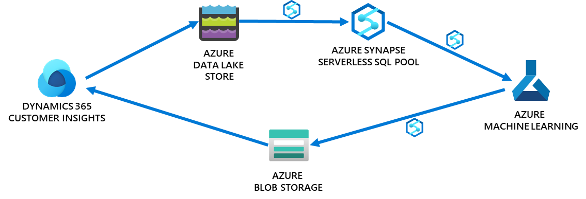

# Dynamics 365 Customer Insights and Azure Data Services Workshop

This workshop will help attendees get hands-on experience integrating Dynamics 365 Customer Insights and Azure Data Services. 

## Sample Business Scenario

A company called Telco ABC is trying to improve customer retention. They use Dynamics 365 Customer Insights 
and believe that they need to do more with the data they have about their customers. 
In Customer Insights they have customer demographic attributes and information on the telco services 
purchased by each customer. Outside of Customer Insights they have additional telco detailed transaction data. 
Telco ABC wants to harness all of this data to predict which telecommunications customers are most likely to churn (i.e. to stop using the
service or move to a competitor). The output of this model will allow a
targeted intervention to try to retain these customers since retaining
existing customers is more cost effective than gaining new customers.

While this documentation and the hands-on labs below describe the sample business scenario, 
real Microsoft customers who work through this workshop will bring their 
own their own customer datasets instead of using the sample datasets. Some example 
business scenarios with real customer data are described further in the playbook for this engagement and workshop.

## Playbook

The [workshop playbook document](workshop-playbook.md) outlines a customer engagement and hands-on workshop
designed for Microsoft customers who wish to accelerate their digital
transformation journey by getting closer to their customers with
Dynamics 365 Customer Insights (CI) and enhance their Modern Data Platform
by integrating Dynamics Customer Insights with other Azure Data & AI
Services (ADS).

## Solution Architecture

  

The solution architecture for this engagement is pictured above and
enables the following scenario:

-   Load key customer demographics and other customer attributes to Dynamics 365 Customer Insights with appropriate matching, merging and enrichment.

-   Export customer data from Dynamics 365 Customer Insights to Azure Synapse
    Analytics through Azure Data Lake Store.

-   Orchestrated by Azure Synapse Analytics Pipelines, Azure Synapse
    Analytics Serverless SQL Pools and Mapping Data Flows transform and
    enrich the datasets.

-   Azure Machine Learning trains predictive models and predicts key
    attributes around your customers. The scenario in the sample data is predicting customers who are likely to churn.

-   These predictions land in Azure Blob Storage and are loaded back
    into Dynamics 365 Customer Insights to enrich your customer
    entities.

-   In Dynamics 365 Customer Insights, segmentation is used to proactively try to retain these customers most at risk of churning.

## Prerequisites

Before the workshop day, complete Lab 1 and Lab 2 below. For more information see the workshop playbook section [Prepare for the 1-Day Workshop](workshop-playbook.md#prepare-for-the-1-day-workshop).

## Hands-on Labs

The following labs are part of this workshop:

- [Lab 1](lab01.md) - Customer Insights Data Sources, Unification and Enrichment
- [Lab 2](lab02.md) - Deploying Azure Services
- [Lab 3](lab03.md) - Customer Insights Integration with Azure Synapse Analytics
- [Lab 4](lab04.md) - Predicting Customer Churn in Azure Machine Learning
- [Lab 5](lab05.md) - Import Machine Learning Predictions into Customer Insights
- [Lab 6](lab06.md) - Automating with Synapse Pipelines

## About The Authors

This workshop content has been developed by [Artis Consulting](https://www.artisconsulting.com/), a Microsoft partner focused on Data Analytics, AI, IoT and Intelligent Apps.

 

## Questions

Issues or problems? Talk to your Microsoft team and/or post a question on the [Issues](https://github.com/ArtisConsulting/customer-insights-azure-data-workshop/issues) tab. 

## Contributing

Have a fix or suggested change? [Submit a pull request](https://docs.github.com/en/github/collaborating-with-pull-requests/proposing-changes-to-your-work-with-pull-requests/creating-a-pull-request).
