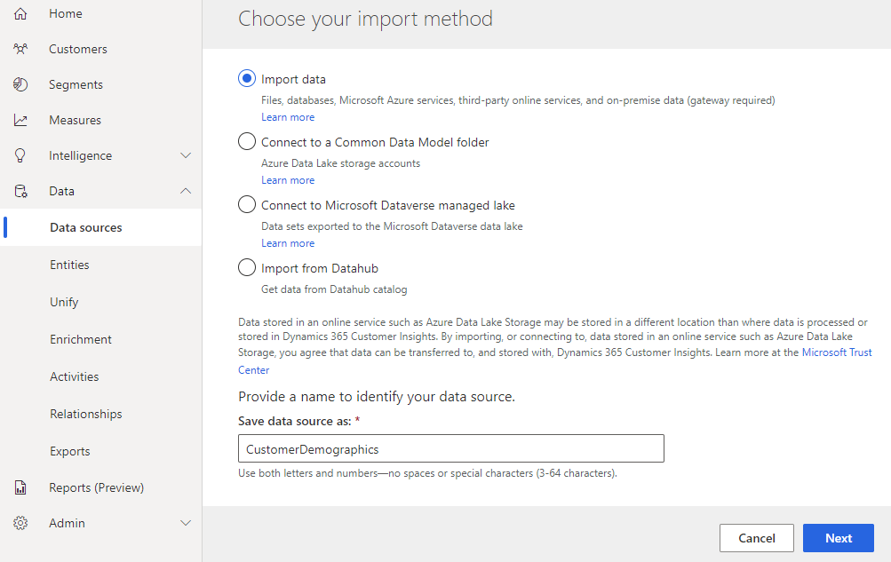
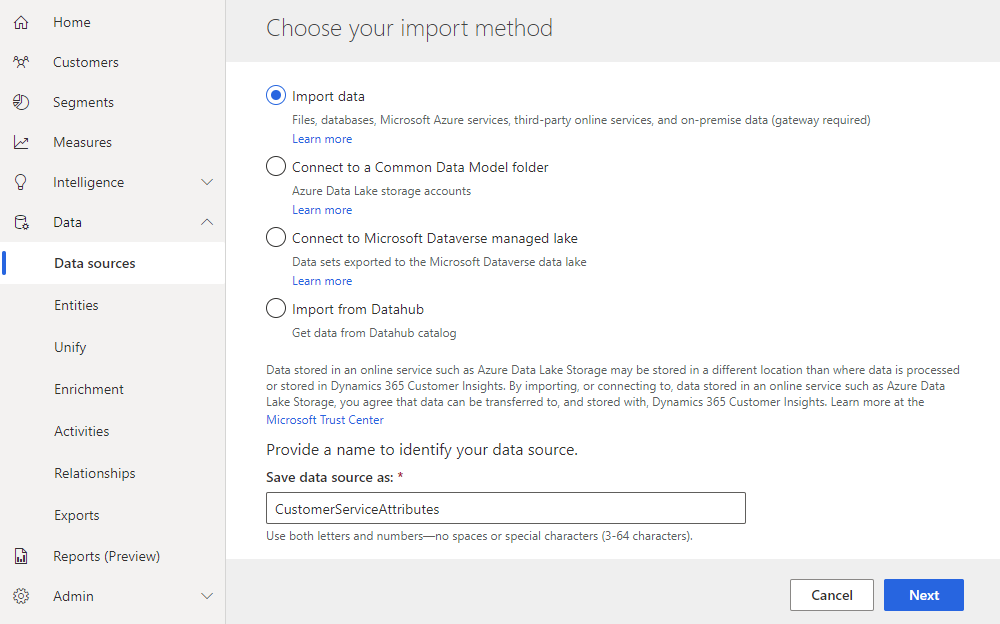
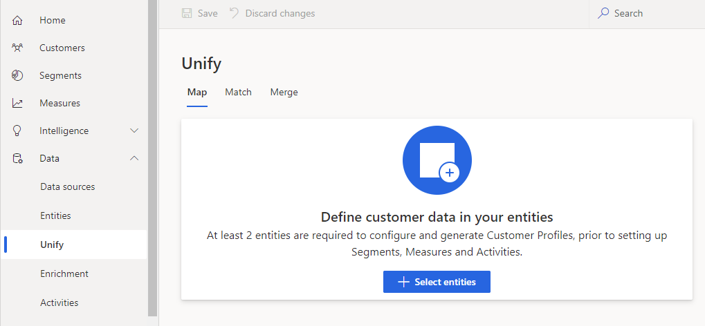
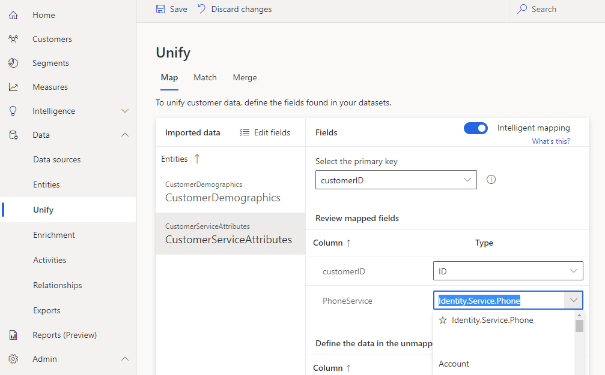
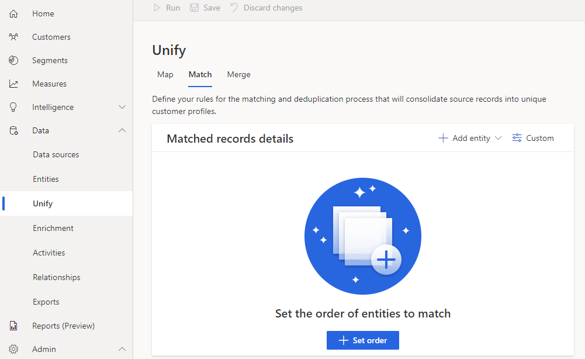
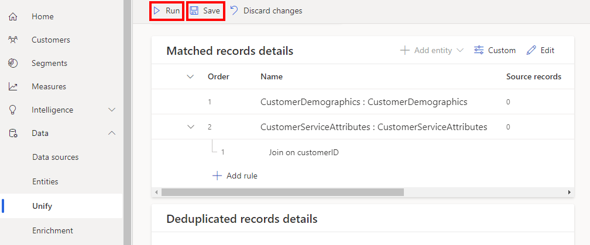
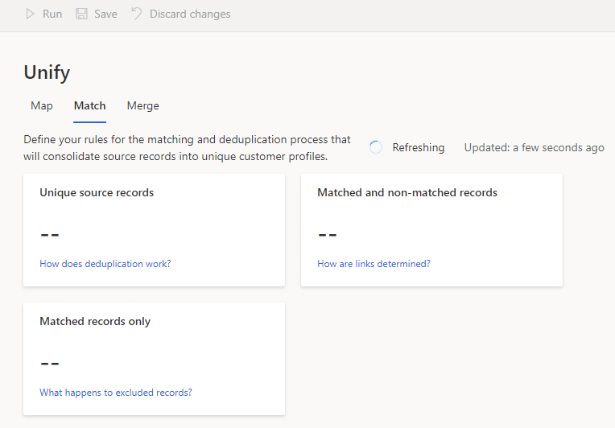
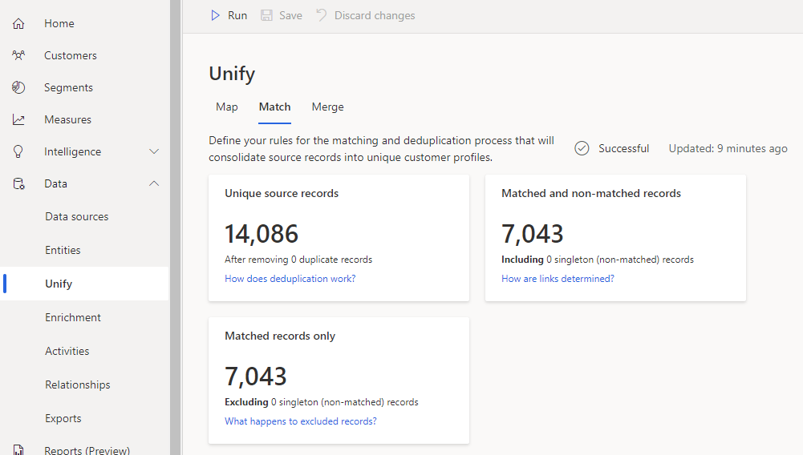
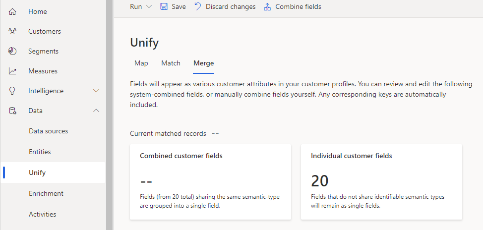
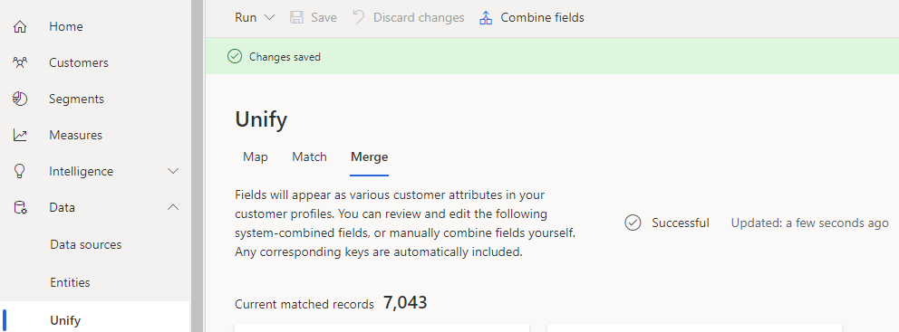

# Lab 1 - Customer Insights Data Sources, Unification and Enrichment

# 

# 

#  

Contents

# 

[Lab Overview](#lab-overview)

[Introduction](#introduction)

[Objectives](#objectives)

[Exercise 1: Import customer
datasets](#exercise-1-import-customer-datasets)

- [Step 1: Sign into Dynamics 365 Customer Insights](#step-1-sign-into-dynamics-365-customer-insights)

- [Step 2: Load CustomerDemographics sample dataset to Customer Insights](#step-2-load-customerdemographics-sample-dataset-to-customer-insights)

- [Step 3: Load CustomerServiceAttributes sample dataset to Customer Insights](#step-3-load-customerserviceattributes-sample-dataset-to-customer-insights)

- [Step 4: Ensure entities are loaded](#step-4-ensure-entities-are-loaded)

[Exercise 2: Unify customer
entities](#exercise-2-unify-customer-entities)

- [Step 1: Map fields in your customer entities](#step-1-map-fields-in-your-customer-entities)

- [Step 2: Match your customer entities on customerID](#step-2-match-your-customer-entities-on-customerid)

- [Step 3: Merge your customer entities](#step-3-merge-your-customer-entities)

[Exercise 3: Enrich customer
entities](#exercise-3-enrich-customer-entities)

- [Step 1: Enrich with Interest affinities](#step-1-enrich-with-interest-affinities)

[Summary](#summary)

# 

# Lab Overview

## Introduction

This hands on lab will provide an overview of key functionality in
Dynamics 365 Customer Insights with a sample dataset. You will load
sample customer data sources and ensure they have been properly mapped,
merged, and enriched. Whether you walk through this lab with sample data
or use your own customer datasets for your business, the steps in this
lab are prerequisites for the later hands on labs.

Prior to this workshop you should have already provisioned a Dynamics
365 Customer Insights environment, granted appropriate access to your
team and loaded appropriate customer datasets relevant to your business.
If you have completed these steps, skim the instructions below to ensure
you have completed each type of activity as they are prerequisites for
later labs.

## Objectives

The objectives of this exercise are to:

-   Import customer datasets into your Dynamics 365 Customer Insights
    environment

-   Map the fields in your customer entities

-   Merge multiple entities on customer key columns

-   Perform enrichment of your data using external industry sources and
    services

The estimated time for this lab is 90 minutes

# Exercise 1: Import customer datasets

In this section you will import sample customer datasets to your
Dynamics 365 Customer Insights environment. The steps below will show
how to load a demo dataset which will be used for illustrative purposes
in this hands on lab. They can be skipped if your real datasets are
already loaded, unified and enriched appropriately.

## Step 1: Sign into Dynamics 365 Customer Insights

Browse to <https://home.ci.ai.dynamics.com/> and sign in with your
organizational account.

If you don’t have a Customer Insights environment provisioned already
and wish take advantage of a trial environment, visit
<https://aka.ms/tryci>

## Step 2: Load CustomerDemographics sample dataset to Customer Insights

Go to the Data… Data sources tab and click “Add data source”

Choose “Import data” and enter a dataset name “CustomerDemographics”

Search for “Web” and choose “Web API” which is a quick way to import a
dataset from a public website. (Your actual business data could come
from any other type of data source which Power Query Online supports.)

Paste in the following URL and click Next:

<https://raw.githubusercontent.com/ArtisConsulting/customer-insights-azure-data-workshop/main/SampleData/CustomerDemographics.csv>

Choose “Transform data”

Click the Transform tab at the top of the Power Query screen and then
click “Use first row as headers”

Confirm the column names read customerID, gender, etc. instead of
Column1, Column2, etc.

Change the query name to CustomerDemographics. Click the Next button at
the bottom of the screen.

Choose to refresh manually (since this is a static sample dataset that
won’t change) and click Save.

While you wait for the CustomerDemographics data source to refresh,
continue onto the next step.

## Step 3: Load CustomerServiceAttributes sample dataset to Customer Insights

Click “Add data source”, Import data, and name it
CustomerServiceAttributes:

Choose Web API like on the previous data source and then paste in the
following URL:

<https://raw.githubusercontent.com/ArtisConsulting/customer-insights-azure-data-workshop/main/SampleData/CustomerServiceAttributes.csv>

Accept the existing connection since this data source is from the same
website.

Click “Transform data”:

On the Transform tab click “User first row as headers”:

Confirm the column headers now say customerID, tenure, PhoneService,
etc.

Left click on the ABC icon next to the tenure column header and choose
“Whole number” to convert this column to an integer data type.

Rename the query to CustomerServiceAttributes and then click click the
Next button at the bottom of the screen.

Choose to refresh manually and click Save.

## Step 4: Ensure entities are loaded

Once the data sources are done refreshing (it takes approximately 5
minutes), go to the Entities tab and click each entity:

On the Data tab for each entity, ensure that rows have been loaded and
are visible. If no rows are shown, go back to the “Data sources” left
nav and refresh the data sources again.

# Exercise 2: Unify customer entities

In this section you will map, match and merge your sample customer
entities in your Dynamics 365 Customer Insights environment. This step
is a prerequisite for later steps and labs.

## Step 1: Map fields in your customer entities

On the Data… Unify left nav, click “+ Select entities” on the Map tab:

Click the checkboxes next to the two entities you with to map then click
Apply:

Click the CustomerDemographics entity. Because “intelligent mapping” is
selected, it will have already set the Type on the Country, customerID,
gender and zip columns. Set the primary key to customerID.

Click on the CustomerServiceAttributes entity. Set the primary key to
customerID. Notice the intelligent mapping has incorrectly categorized
the PhoneService column as this column indicates whether this telco
customer has phone service or not. Dropdown the Type dropdown next to
PhoneService and choose the blank value to blank out the Type on this
column. Then click the Save button at the top of the page.

## Step 2: Match your customer entities on customerID

Go to the Match tab and click the “+Set order” button.

Choose CustomerDemographics to the first or primary entity. Choose
CustomerServiceAttributes to be the second entity. Click Done.

Click the Add Rule button:

Select customerID from both “Select field” dropdowns. Name this rule and
click Done.

Click the **Save** button at the top and then click the **Run** button
at the top.

Wait while the matching runs. It takes approximately 5 minutes.

When the matching is complete, validate that you have the proper matched
record counts:

## Step 3: Merge your customer entities

On the Merge tab, if you need to combine any fields, ignore or rename
any fields do that. For the sample dataset, nothing needs to be done
except click **Save** and click **Run… Run only Merge**.

When merging is complete the screen will update with the current matched
records count:

# Exercise 3: Enrich customer entities

In this section you will enrich your customer entities in your Dynamics
365 Customer Insights environment using external sources and services.

## Step 1: Enrich with Interest affinities

On the Enrichment left nav click “Enrich my data” on the “Interests”
tile to enrich your data with interest affinities from people in a
similar demographic to your customers.

On the overview tab, click Next

On the Interests tab choose “Internet & Telecom” from the dropdown (or
whatever industry makes sense for your business).

Click the + icon next to Search Engines, Internet Service Plans,
Teleconferencing, and Cable Services, then click Next.

On the Preferences tab, review the settings and click Next.

On the Required data tab choose the Customer dataset and click Next:

On the Attribute mapping tab, follow the instructions. For the sample
dataset, ensure the Gender, Country/Region, and Postal code fields are
mapped to columns in your dataset. For you own dataset, follow the
documentation on the [required
fields](https://docs.microsoft.com/en-us/dynamics365/customer-insights/audience-insights/enrichment-microsoft#map-your-fields).
Click Next.

On the Review and run tab, review the settings, name your enrichment and
click “**Save enrichment**”.

Then click Run:

# Summary

In this lab, you loaded, mapped, merged and enriched customer entities
in Dynamics 365 Customer Insights. Later labs build on this work using
key Azure data services to add value to your customer data.
