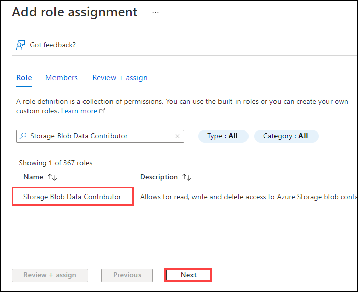
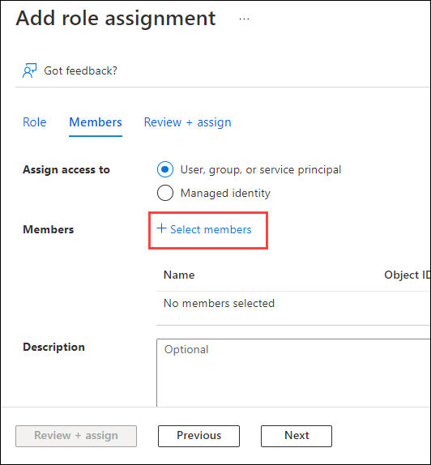
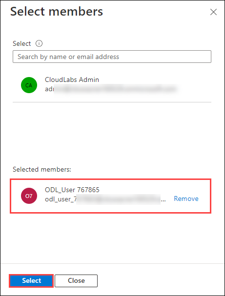
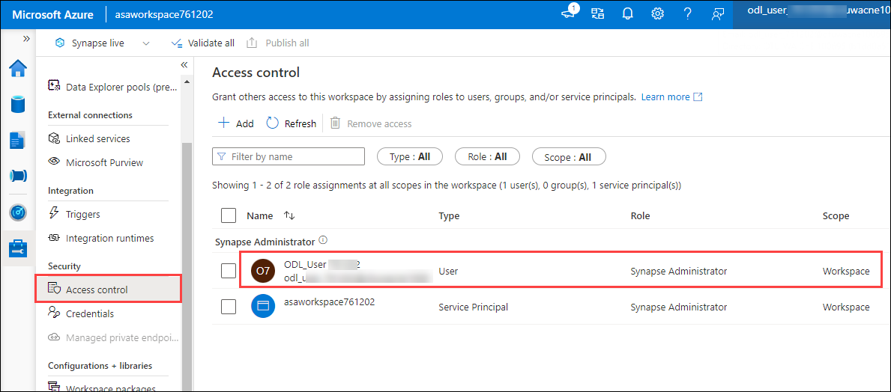

# Lab 2 - Deploying Azure Services


# Lab Overview

## Introduction

This hands on lab will deploy the necessary Azure services to support
subsequent labs. The services that are deployed are Azure Synapse
Analytics, Azure Machine Learning, Azure Data Lake Storage Gen2, and a
few supporting services like Azure Key Vault and Azure Application
Insights.

## Objectives

The objectives of this exercise are to:

-   Learn how to deploy Azure services with an Azure Resource Manager
    template

-   Learn how to use Role Based Access Control (RBAC) to grant access to
    Azure resources

The estimated time for this lab is 30 minutes

# Exercise 1: Deploy ARM Template

In this section you will deploy the necessary Azure services into your
Azure subscription using a parameterized Azure Resource Manager (ARM)
template.


## Step 1: Deploy the ARM template

1.  Go to the Access control (IAM) left nav of the resource group **customer-insights-workshop-rg**. Click the **View my access** button. Ensure
    that you are assigned the Owner role for this resource group (or the
    Owner role is inherited from the subscription or management group). 

    _Note: RBAC permissions changes can take up to **15 minutes** to propogate._

    

1.  Copy the below URL and paste it in your browser window which will prompt you to
    enter several parameters for deploying Azure resources:

     ```
     https://portal.azure.com/#create/Microsoft.Template/uri/https%3A%2F%2Fraw.githubusercontent.com%2FArtisConsulting%2Fcustomer-insights-azure-data-workshop%2Fmain%2FAzureSetup%2FArmTemplate.json
     ```

1.  On the Custom deployment form fill in the choose the right Azure
    subscription and choose the **customer-insights-workshop-rg** resource group.

    Then fill in the following “Instance details”:

    -   **Region** – This should default to the region your resource group
        is in and shouldn’t be changed

    -   **Unique Suffix** – Enter **<inject key="Deployment ID" />**

    -   **SQL Administrator Login Password** – Enter **<inject key="LABVM Admin Password" />**

1.  Review the requirements for the password again carefully. Click the
    **Review + create** button.

    If you get any validation failures, click the arrow to investigate
    the problems and resolve them by clicking the Previous button,
    changing the parameters, then trying again:

    

1.  You should see a “Validation passed” message. Click **Create**.

    

1.  The deployment should take around 5-10 minutes. If you get any
    errors, press the “Redeploy” button at the top and correct the
    parameters appropriately and deploy again using the same suffix as
    your previous attempt. If all else fails, delete all the resources
    from the resource group and try the deployment again with a
    **different** suffix (since the deleted key vault has the [soft
    delete feature
    enabled](https://docs.microsoft.com/en-us/azure/key-vault/general/soft-delete-overview)).

    Once the deployment completes you should have the following
    resources:

    -   **amlworkspace<inject key="Deployment ID" enableCopy="false" />** - An Azure Machine Learning workspace you
        will use in a later lab to build machine learning models to enrich
        your customer data

    -   **asaappinsights<inject key="Deployment ID" enableCopy="false" />** - The Azure Application Insights which
        is tied to your Azure Machine Learning workspace

    -   **asadatalake<inject key="Deployment ID" enableCopy="false" />** - The Azure Data Lake Store Gen2 storage
        account which will be the primary storage for Synapse and for export
        from Customer Insights

    -   **asakeyvault<inject key="Deployment ID" enableCopy="false" />** - The Azure Key Vault tied to your Azure
        Machine Learning workspace for storage of secrets

    -   **asastore<inject key="Deployment ID" enableCopy="false" />** - The Azure blob storage account tied to your
        Azure Machine Learning workspace. (Storage accounts with
        hierarchical namespace enabled like the asadatalake storage account
        are not supported by Azure Machine Learning at the time of this
        writing, so a separate blob storage account was created for Azure ML
        internal storage.)

    -   **asaworkspace<inject key="Deployment ID" enableCopy="false" />** - The Azure Synapse Analytics workspace.
        The Serverless SQL pool is part of this workspace. You can use
        Synapse Studio to interact with this workspace.

## Step 2: Grant permissions to the team

Any other developers on the team who will need to create and monitor
this solution should be given permissions to it. The user who will setup
the export from Customer Insights to Azure and the remaining labs should
have permission to this Azure resource group. Permissions are maintained
using Role Based Access Control (RBAC). While it’s a best practice to
use groups instead of assigning permissions to individual users, for the
purposes of this lab feel free to assign permissions to individual users
if you don’t have an appropriate group handy.

1.  On the **Access control (IAM)** left nav of the
    **customer-insights-workshop-rg** click **+Add** and **Add role
    assignment**.

    

1. On the **Add role assignment** screen, select **Storage Blob Data
    Contributor** from the list, then choose **Next**.
    
    
    
1. On the **Add role assignment** Members tab, select the **+ Select members** link beneath the **Members** field.

    
    
1. Select the user **<inject key="AzureAdUserEmail"></inject>** and click on **Select**. On the role assignment blade, select **Review + assign**, then **Review + assign** once more.

   
    
1.  In the search box at the top of the Azure portal,
    search for “asaworkspace” and click on the Synapse workspace (not the
    SQL Server) which appears under the Resources section.

    

1.  On the Overview blade and the Essentials section, click the Workspace
    web URL link to open Synapse Studio.

    Go to the Manage left nav and the Access control left nav. Make sure that user is assigned with **Synapse Administrator** role.

    


# Summary

In this lab, you learned how to create an Azure resource group,
provision Azure resources with an Azure Resource Manager template, and
grant access to those resources.

Next, go to [Lab 3](lab03.md).
