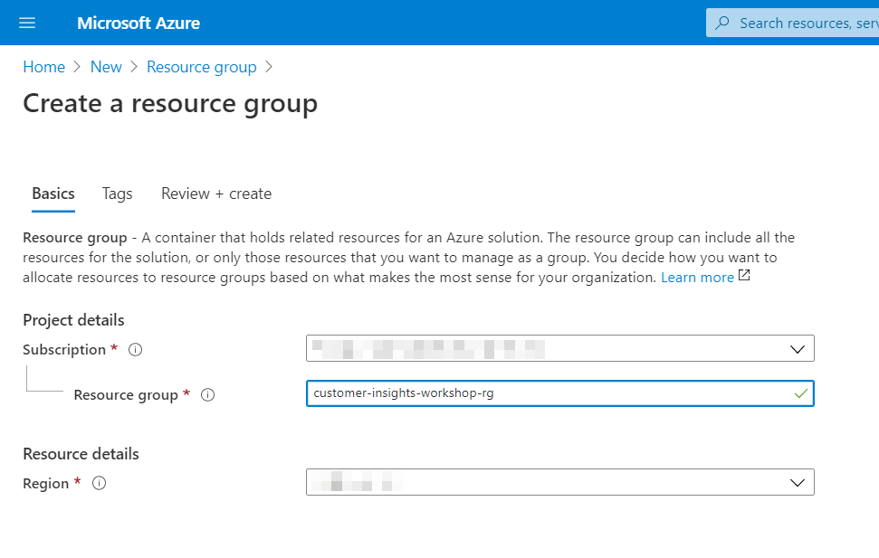
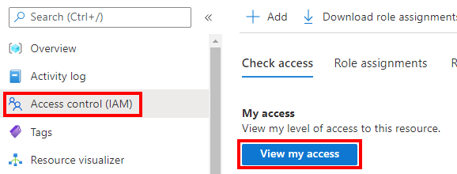
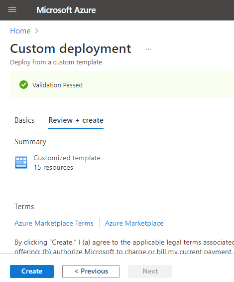
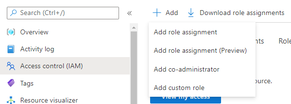
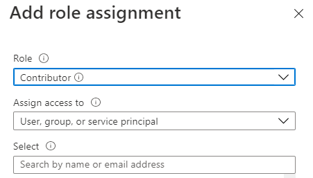
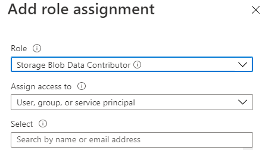
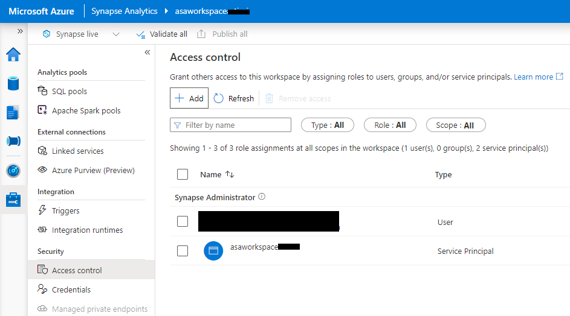
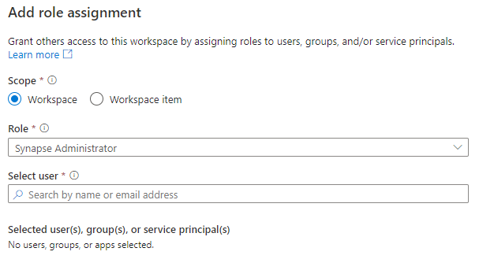

# Lab 2 - Deploying Azure Services

#  

Contents

# 

[Lab Overview](#lab-overview)

[Introduction](#introduction)

[Objectives](#objectives)

[Exercise 1: Deploy ARM Template](#exercise-1-deploy-arm-template)

- [Step 1: Create an Azure Resource Group](#step-1-create-an-azure-resource-group)

- [Step 2: Deploy the ARM template](#step-2-deploy-the-arm-template)

- [Step 3: Grant permissions to the team](#step-3-grant-permissions-to-the-team)

- [Step 4: Cleanup Azure resources (at conclusion of workshop)](#step-4-cleanup-azure-resources-at-conclusion-of-workshop)

[Summary](#summary)

# 

# Lab Overview

## Introduction

This hands on lab will deploy the necessary Azure services to support
subsequent labs. The services that are deployed are Azure Synapse
Analytics, Azure Machine Learning, Azure Data Lake Storage Gen2, and a
few supporting services like Azure Key Vault and Azure Application
Insights.

## Objectives

The objectives of this exercise are to:

-   Learn how to deploy Azure services with an Azure Resource Manager
    template

-   Learn how to use Role Based Access Control (RBAC) to grant access to
    Azure resources

The estimated time for this lab is 30 minutes

# Exercise 1: Deploy ARM Template

In this section you will deploy the necessary Azure services into your
Azure subscription using a parameterized Azure Resource Manager (ARM)
template.

## Step 1: Create an Azure Resource Group

Note, you may need your Azure administrator to do this step for you if
you do not have Owner permissions on an Azure subscription.

Log into the [Azure Portal](https://portal.azure.com/) using your Azure
credentials. You should sign in with the organizational account and your
Azure subscription you will use for this deployment should be in the
same tenant as your Dynamics 365 Customer Insights environment.

1. On the Azure Portal home screen, select the **+ Create a
    resource** tile.

    

1.  In the **Search the Marketplace** text box, type **Resource group** and
    press the **Enter** key.

    

1.  Select the **Create** button on the **Resource group** overview
    page.

    - On the **Create a resource group** screen, select your desired
    Subscription and Region. Be sure to choose a [region which supports](https://azure.microsoft.com/en-us/global-infrastructure/services/?products=synapse-analytics,machine-learning-service,storage,monitor) Azure Synapse Analytics workspaces, Azure Data Lake Storage, Azure Machine Learning, and Application Insights. For Resource group,
    
    - enter **customer-insights-workshop-rg**, then select the **Review +Create** button.

    

1.  Select the **Create** button once validation has passed.

    In the top right, you will get a notification popup (or you can click
    the bell icon to see all notifications) once the resource group is
    created. Click “Go to resource group”

## Step 2: Deploy the ARM template

1.  Go to the Access control (IAM) left nav of the resource group you
    created in the previous step. Click the “View my access” button. Ensure
    that you are assigned the Owner role for this resource group (or the
    Owner role is inherited from the subscription or management group). If
    you are not an Owner, then ask your Azure administrator to make you an
    Owner on this resource group. Or ask your Azure administrator to perform
    this deployment for you. Owner permissions will also be required for some steps in Lab 3.

    _Note: RBAC permissions changes can take up to **15 minutes** to propogate._

    

1.  CTRL+click (on Windows) or CMD+click (on MacOS) the **Deploy to Azure** button below which will prompt you to
    enter several parameters before deploying Azure resources:

    

1.  On the Custom deployment form fill in the choose the right Azure
    subscription and choose the **customer-insights-workshop-rg** resource group
    you just created.

    Then fill in the following “Instance details”:

    -   **Region** – This should default to the region your resource group
        is in and shouldn’t be changed

    -   **Unique Suffix** – This suffix will be added to the name of each of
        the Azure resources you are about to create. It should be only
        lowercase letters and numbers and should be 13 characters or fewer.
        It must be unique (shouldn’t be the same suffix anyone else using
        this workshop has used) and you will get a validation failure if you
        don’t choose a unique suffix.

    -   **SQL Administrator Login Password** – This is the password for the
        Synapse SQL admin login named “asa.sql.admin”. Choose a strong
        password which is between 8 and 128 characters long and which
        contains characters from three of the following four categories:
        (uppercase letters, lowercase letters, digits (0-9),
        Non-alphanumeric characters such as: !, $, #, or %). Your password
        cannot contain all or part of the “asa.sql.admin” login name. Part
        of a login name is defined as three or more consecutive alphanumeric
        characters. Save this password in your own password vault or note it
        securely somewhere.

1.  Review the requirements for the password again carefully. Click the
    **Review + create** button.

    If you get any validation failures, click the arrow to investigate
    the problems and resolve them by clicking the Previous button,
    changing the parameters, then trying again:

    

1.  You should see a “Validation passed” message. Click **Create**.

    

1.  The deployment should take around 5-10 minutes. If you get any
    errors, press the “Redeploy” button at the top and correct the
    parameters appropriately and deploy again using the same suffix as
    your previous attempt. If all else fails, delete all the resources
    from the resource group and try the deployment again with a
    **different** suffix (since the deleted key vault has the [soft
    delete feature
    enabled](https://docs.microsoft.com/en-us/azure/key-vault/general/soft-delete-overview)).

    Once the deployment completes you should have the following
    resources:

    -   **amlworkspace\<suffix>** - An Azure Machine Learning workspace you
        will use in a later lab to build machine learning models to enrich
        your customer data

    -   **asaappinsights\<suffix>** - The Azure Application Insights which
        is tied to your Azure Machine Learning workspace

    -   **asadatalake\<suffix>** - The Azure Data Lake Store Gen2 storage
        account which will be the primary storage for Synapse and for export
        from Customer Insights

    -   **asakeyvault\<suffix>** - The Azure Key Vault tied to your Azure
        Machine Learning workspace for storage of secrets

    -   **asastore\<suffix>** - The Azure blob storage account tied to your
        Azure Machine Learning workspace. (Storage accounts with
        hierarchical namespace enabled like the asadatalake storage account
        are not supported by Azure Machine Learning at the time of this
        writing, so a separate blob storage account was created for Azure ML
        internal storage.)

    -   **asaworkspace\<suffix>** - The Azure Synapse Analytics workspace.
        The Serverless SQL pool is part of this workspace. You can use
        Synapse Studio to interact with this workspace.

## Step 3: Grant permissions to the team

Any other developers on the team who will need to create and monitor
this solution should be given permissions to it. The user who will setup
the export from Customer Insights to Azure and the remaining labs should
have permission to this Azure resource group. Permissions are maintained
using Role Based Access Control (RBAC). While it’s a best practice to
use groups instead of assigning permissions to individual users, for the
purposes of this lab feel free to assign permissions to individual users
if you don’t have an appropriate group handy.

1.  On the **Access control (IAM)** left nav of the
    **customer-insights-workshop-rg** click **+Add** and **Add role
    assignment**.

    

1.  One at a time, grant each developer the Contributor role by choosing
    Role=Contributor and searching for their name, selecting their name, and
    clicking Save.

    
    
1.  Repeat the process for the Storage Blob Data Contributor role. One at a
    time, grant each developer the role by choosing Role=Storage Blob Data
    Contributor and searching for their name, selecting their name, and
    clicking Save. Be sure to assign **yourself** “Storage Blob Data
    Contributor” role, too!

    

1.  Next, you need to grant each developer Synapse Administrator role from
    within Synapse Studio. In the search box at the top of the portal,
    search for “asaworkspace” and click on the Synapse workspace (not the
    SQL Server) which appears under the Resources section.

    

1.  On the Overview blade and the Essentials section, click the Workspace
    web URL link to open Synapse Studio.

    Go to the Manage left nav and the Access control left nav. Click the Add
    button to add a role:

    

1.  Choose Scope of Workspace, choose Role as Synapse Administrator, then
    type in the names of the teammates you wish to allow to access. Then
    click Apply.

    

## Step 4: Cleanup Azure resources (at conclusion of workshop)

When you are **COMPLETELY DONE** with all your work in **all the other
labs**, you can optionally delete these Azure resources. Go to the
Overview blade of the **customer-insights-workshop-rg** and click the
**Delete resource group** button. Your Azure resources and all the data
in them will be deleted and unrecoverable.

# Summary

In this lab, you learned how to create an Azure resource group,
provision Azure resources with an Azure Resource Manager template, and
grant access to those resources.

Next, go to [Lab 3](lab03.md).
