# Lab 3 - Customer Insights Integration with Azure Synapse Analytics


#  

Contents

# 

[Lab Overview](#lab-overview)

[Introduction](#introduction)

[Objectives](#objectives)

[Exercise 1: Export data from Customer
Insights](#exercise-1-export-data-from-customer-insights)

- [Step 1: Add a connection to Synapse](#step-1-add-a-connection-to-synapse)

- [Step 2: Export entities to Synapse](#step-2-export-entities-to-synapse)

- [Step 3: View data in Synapse Serverless using Synapse Studio](#step-3-view-data-in-synapse-serverless-using-synapse-studio)

- [Step 4: Enrich the customer data](#step-4-enrich-the-customer-data)

[Summary](#summary)

# 

# Lab Overview

## Introduction

This hands on lab will be an overview of exporting data from Dynamics 365
Customer Insights to Azure Synapse Analytics. You will then use Synapse
Serverless SQL to enrich the customer datasets with additional
information.

Prior to this lab you should have completed Lab 1 either with your own
business data or with the sample datasets. Prior to this lab you should
have also completed Lab 2 so that the Azure services are already
provisioned.

If you do not have Owner permissions on your Azure resource group you created in Lab 2, you may need your Azure administrator to perform Step 1 and Step 2 in this lab below.

## Objectives

The objectives of this exercise are to:

-   Learn how to export customer data from Dynamics 365 Customer
    Insights to Azure Synapse Analytics

-   Learn how to enrich the dataset using Azure Synapse Analytics
    Serverless SQL compute

The estimated time for this lab is 60 minutes

# Exercise 1: Export data from Customer Insights

In this section you will export your customer entities from Dynamics 365
Customer Insights to an Azure Synapse Analytics Serverless SQL pool.
Under the covers, it exports the data to your Azure Data Lake Store Gen2
account and creates an “external table” in Synapse Serverless SQL to
query those datasets.

## Step 1: Add a connection to Synapse

1.  Browse to <https://home.ci.ai.dynamics.com/> and sign in with your
    organizational account.

    On the Data… Exports left nav, click the **+Add Export** button:

    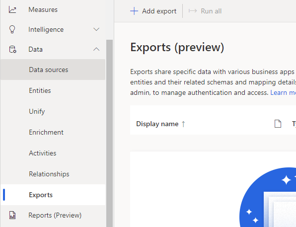

1.  On the **Set up export** pane click **+ Add Connection**.

    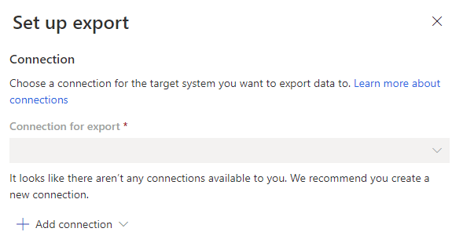

1.  Choose **Azure Synapse Analytics** from the dropdown. Note that the Azure
    Data Lake Store Gen 2 connection just exports files to your Azure Data
    Lake Store (ADLS) account. Azure Synapse Analytics exports to your ADLS
    account and also creates a view called an “external table” in a Azure
    Synapse Analytics Serverless SQL Pool to query the data.

    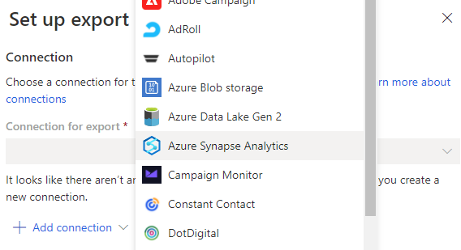

1.  On the **Set up Azure Synapse Analytics connection** pane, type in a name
    for this connection, choose the Azure subscription, Synapse workspace
    (**asaworkspace<inject key="Deployment ID" enableCopy="false" />**), Storage account (**asadatalake<inject key="Deployment ID" enableCopy="false" />**), and
    Container (staging).

    _Note: Your user must be an Owner on the customer-insights-workshop-rg resource group for the following to work. If you are not sure you have Owner permissions, go back to Lab 2 [Step 2: Deploy the ARM template](lab02.md#step-2-deploy-the-arm-template) and work through the #1 item to "View my access". RBAC permissions changes can take up to **15 minutes** to propogate._

    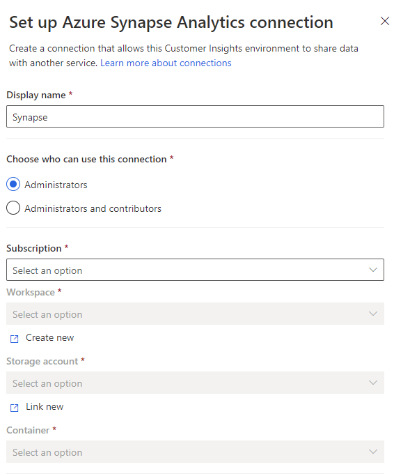

1.  Scroll down to the bottom of the pane and check the **I agree** checkbox.
    Then click **Save**. Note, if you don’t see the Save button in blue, check
    that you have filled in all required fields above. If you have, check
    that you are in your Customer Insights environment rather than a
    Microsoft-provided demo environment like the “Retail Sales” demo
    environment. Also check you have appropriate permissions in Customer
    Insights.

    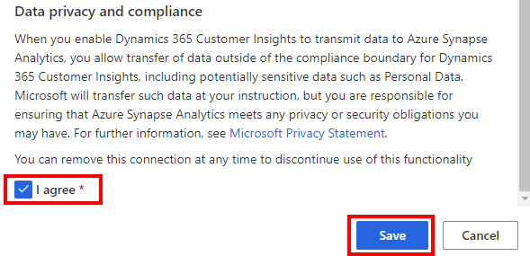

## Step 2: Export entities to Synapse

1.  On the **Set up Azure Synapse Analytics export** pane, choose the
    connection you just setup, name your export **SynapseExport**, name your
    Synapse Serverless SQL database name **CustomerInsightsExport**. Select
    the Customer entity to export. Then click **Save**.

    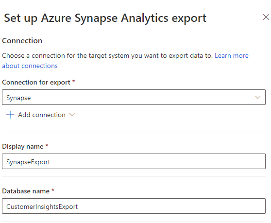

    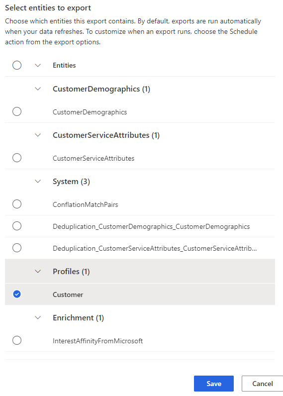

1.  Then press the **Run all** button at the top of the Exports screen:

    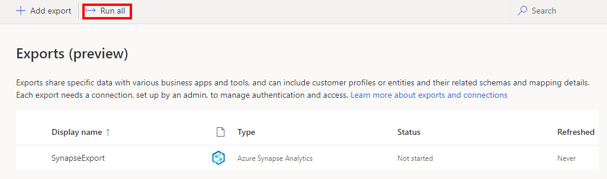

1.  Wait until the screen shows it is completed successfully:

    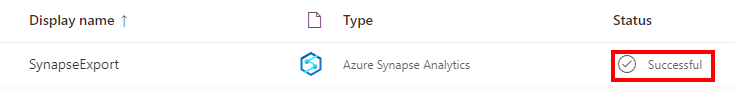

## Step 3: View data in Synapse Serverless using Synapse Studio

1.  Go to <https://portal.azure.com> and sign in with your organizational
    account.

    In the search box at the top of the portal, search for **asaworkspace**
    and click on the Synapse workspace (not the SQL Server) which appears
    under the Resources section.

    

1.  On the Overview blade and the Essentials section, click the Workspace
    web URL link to open Synapse Studio.

    Click on the Data pane on the left. It is the
    
    icon. Expand the Databases, CustomerInsightsExport database, Tables
    folder, then right click on the Customer table and choose New SQL
    script… Select TOP 100 rows:

    

1.  Ensure the “Connect to” dropdown has **Built-in** (meaning the Synapse
    Serverless SQL pool) selected. Then click the Run button in the SQL
    script 1 tab to view some rows in your exported Customer data.

    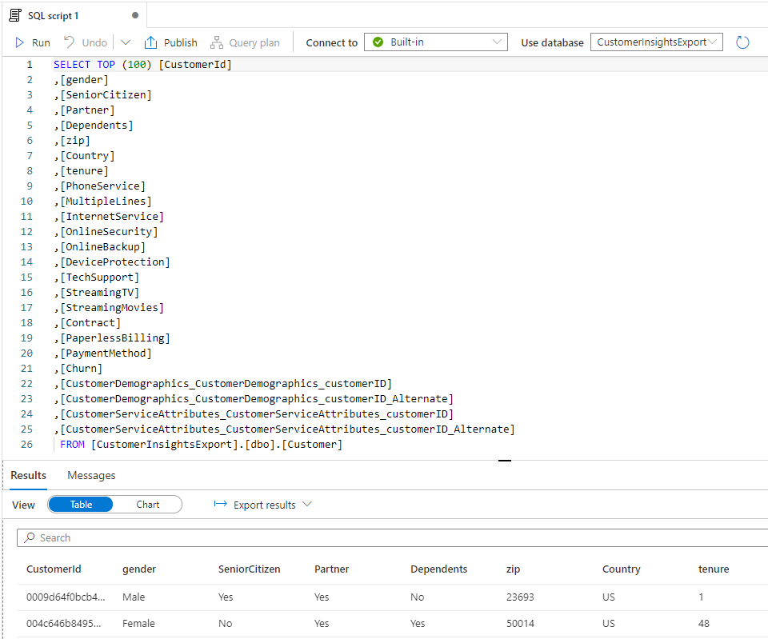

1.  Highlight the current query and press the backspace key to delete the
    query text. Paste the following query into the query window, replace
    \<suffix> with **<inject key="Deployment ID" />**, and click the Run
    button at the top of the screen.

    ```sql
    CREATE CREDENTIAL [https://asadatalake<suffix>.dfs.core.windows.net]
    WITH IDENTITY = 'Managed Identity';
    ```

    The server-scoped credential you just created instructed Synapse
    Serverless SQL to use the Synapse workspace managed service identity
    (MSI) to authenticate with ADLS when a SQL user account needs to access
    ADLS without any other credentials specified. (The MSI is named to match
    the Synapse workspace name **asaworkspace<inject key="Deployment ID" enableCopy="false" />**.) Note, in Lab 2, the
    ARM template which deployed the Azure services ensured that the MSI had
    the Storage Blob Data Contributor role on the resource group. For
    further information, view the documentation
    [here](https://docs.microsoft.com/en-us/azure/synapse-analytics/sql/develop-storage-files-storage-access-control?tabs=managed-identity#server-scoped-credential).

1.  To validate the Synapse MSI has the proper permissions created by the ARM template, go to the Azure portal, go to the customer-insights-workshop-rg resource group, click the Access control (IAM) tab, and confirm **asaworkspace<inject key="Deployment ID" enableCopy="false" />** has Storage Blob Data Contributor permissions.

     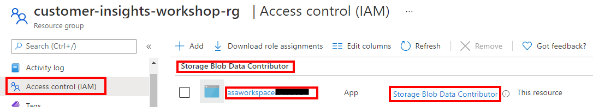


## Step 4: Enrich the customer data

1.  Right click on this
    [CustomerCharges.csv](https://raw.githubusercontent.com/ArtisConsulting/customer-insights-azure-data-workshop/main/SampleData/CustomerCharges.csv)
    link and choose “Save link as…” and name the file **CustomerCharges.csv** (not CustomerCharges.txt) on
    your workstation. We will now upload this file to Azure Data Lake
    Storage Gen2 (ADLS).

    Click on the Data pane on the left. It is the
    
    icon. Then go to the Linked tab. Expand Azure Data Lake Storage Gen2 and
    click on the default storage account (**asaworkspace<inject key="Deployment ID" enableCopy="false" />**) and click
    on the staging container.

     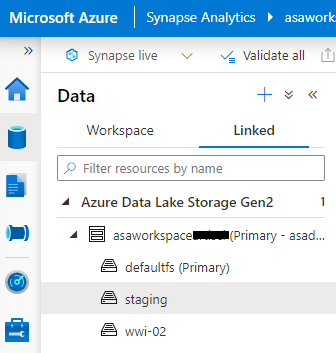

1.  Click the **+ New folder** button and create a new folder called **Charges**.

     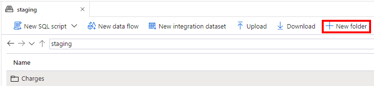

1.  Double click the new Charges folder. Then click the **Upload** button:

     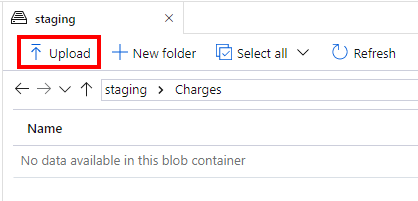

1.  Choose the CustomerCharges.csv file you previously downloaded and click
    **Upload**.

     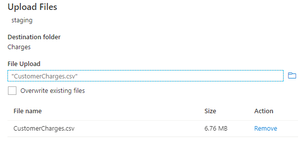

1.  Right click on the CustomerCharges.csv file that has been uploaded to
    ADLS and choose New SQL Script… Select TOP 100 rows.

     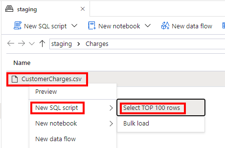

1.  Ensure the “Connect to” dropdown has **Built-in** (meaning the Synapse
    Serverless SQL pool) selected then click Run. This OPENROWSET query will
    read from the CustomerCharges.csv file in ADLS. Notice that the header
    row is treated like a row of data.

    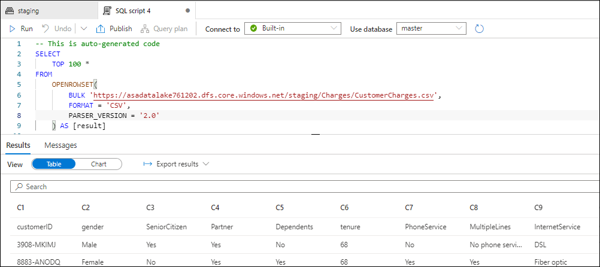

1.  To fix the header row, paste in the following query and fix \<suffix>
    then run the query: 

    ```sql
    SELECT
    TOP 100 *
    FROM
    OPENROWSET(
      BULK 'https://asadatalake<suffix>.dfs.core.windows.net/staging/Charges/',
      FORMAT = 'CSV',
      PARSER_VERSION='2.0',
      HEADER_ROW = TRUE
      )
    WITH (
      customerID VARCHAR(20),
      Charge decimal(20,2),
      ChargeDate date
      ) c
    ```


  > 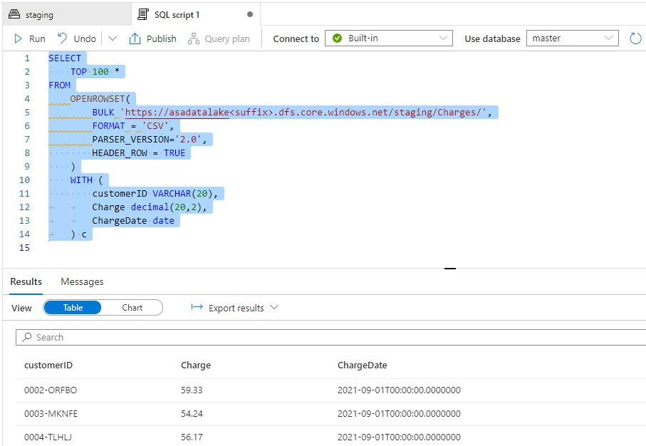

8.  Replace the “SELECT TOP 100 \*” line of the query with the following
    code which creates a CI database with the [UTF8
    collation](https://docs.microsoft.com/en-us/azure/synapse-analytics/troubleshoot/reading-utf8-text)
    in Synapse Serverless SQL pool, changes the context of the current
    connection to the CI database with the USE statement, then creates a new
    view named dbo.CustomerChurnCharges which selects all rows from the
    CustomerCharges.csv file. The reason that we have to create this view in
    the CI database is that the CustomerInsightsExport database is a special
    database which is marked as “replicated” (from Customer Insights) so
    cannot have user-defined objects like views added to it. So if you get
    the error “Operation CREATE/ALTER VIEW is not allowed for a replicated
    database” then make sure the CREATE DATABASE and USE statements below
    have been run.


    ```sql
    CREATE DATABASE CI
        COLLATE Latin1_General_100_BIN2_UTF8;

    GO

    USE CI;

    GO

    CREATE VIEW dbo.CustomerChurnCharges
    AS
    SELECT *
    <remainder of the prior query here> 
    ```
   
1. Highlight all statements and click the Run button.
    
     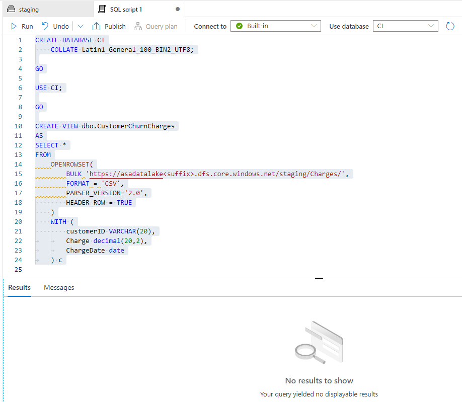
       
1.  Now let’s create a new view which joins the Customer data exported from
    Customer Insights with the CustomerChurnCharges view. Copy and paste
    this query into the SQL script 1 window, make sure the “Use database”
    dropdown says “CI” still, and click Run:

    ```sql
    CREATE OR ALTER VIEW dbo.CustomerChurn
    AS
    SELECT c.CustomerDemographics_CustomerDemographics_customerID as customerID, 
    c.[gender], 
    c.[SeniorCitizen], 
    c.[Partner], 
    c.[Dependents], 
    c.[tenure], 
    c.[PhoneService], 
    c.[MultipleLines], 
    c.[InternetService], 
    c.[OnlineSecurity], 
    c.[OnlineBackup], 
    c.[DeviceProtection], 
    c.[TechSupport], 
    c.[StreamingTV], 
    c.[StreamingMovies], 
    c.[Contract], 
    c.[PaperlessBilling], 
    c.[PaymentMethod], 
    cc.[MonthlyCharges], 
    cc.[TotalCharges], 
    c.[Churn]
    FROM [CustomerInsightsExport].[dbo].[Customer] c
    LEFT JOIN (
        SELECT customerID, avg(Charge) as MonthlyCharges, sum(Charge) as TotalCharges
        FROM CI.dbo.CustomerChurnCharges cc
        GROUP BY customerID
    ) cc on cc.customerID = c.CustomerDemographics_CustomerDemographics_customerID
    ```

    To explain what this query is doing, we are summarizing the charges to
    one row per customer showing average monthly charges and total charges,
    then we’re joining to the Customer Insights export and creating a new
    view that has all the columns we need.

    We will hand off this query to Azure Machine Learning in the next lab.

# Summary

In this lab, you exported data from Customer Insights to Azure Synapse
Analytics, queried it in a Synapse Serverless SQL pool, enriched it with
an additional dataset and created a view which can be presented to Azure
Machine Learning.

Next, go to [Lab 4](lab04.md).
