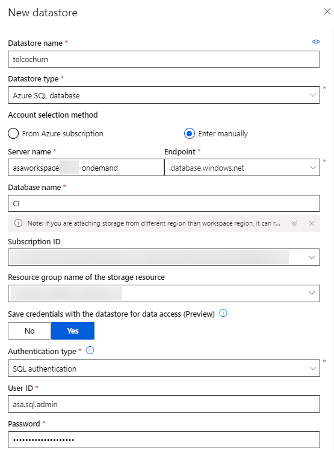
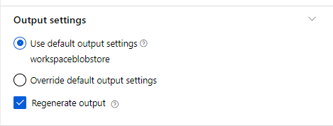

# Lab 4 - Predicting Customer Churn in Azure Machine Learning

 

# Contents

# 

[Introduction](#introduction)

[Objectives](#objectives)

[Step 1: Sign into Azure ML Studio and choose your workspace](#step-1-sign-into-azure-ml-studio-and-choose-your-workspace)

[Step 2: Create Data Connection and Dataset](#step-2-create-data-connection-and-dataset)

[Step 3: Experiment Design](#step-3-experiment-design)

[Step 4: Training models](#step-4-training-models)

[Step 5: Output Model](#step-5-output-model)

# 

# Lab Overview

## Introduction

The purpose of this lab is to allow you to get hands-on experience
creating an Azure Machine Learning model to predict which
telecommunications customers are likely to churn (i.e. to stop using the
service or move to a competitor). The output of this model will allow a
targeted intervention to try to retain these customers since retaining
existing customers is more cost effective than gaining new customers.

## Objectives

The objectives of this exercise are to:

-   Sign into Azure ML

-   Create a datastore connected to Azure Synapse Serverless SQL

-   Create a dataset from the datastore

-   Learn how to prepare the data for machine learning

-   Learn how to perform classification to predict whether a subscriber
    will churn.

-   Learn how to train and evaluate a model

-   Learn how to compare the accuracy of several models.

-   Export the results of the models to Blob Storage

Estimated time for this lab is 75 minutes

# Exercise 1: Creating a Telco Churn Model

This exercise uses an anonymized telecommunications dataset about
customers to predict which customers will cancel their subscription. In
the telecommunications industry, a subscriber cancelling is called
“churn.”

## Step 1: Sign into Azure ML Studio and choose your workspace

In this step, you will sign into Azure ML Studio and choose which
workspace you will use for creating experiments.

1.  Navigate to [ml.azure.com](https://ml.azure.com/) in your browser.
    If you’re already signed in, you will be directed to the main Azure
    ML screen. If not, you will be asked to sign in.

    

2.  Select your “amlworkspace\<suffix>” Azure ML workspace you created
    in Lab 2 from the drop-down menu. Click the “Get started” button.
    You will be directed to the Azure ML home screen.

    

3.  In the top right, there is a directory and workspace selection.
    Ensure you are in the desired directory, subscription and workspace.

    

## Step 2: Create Data Connection and Dataset

In this step, you connect to Azure Synapse Serverless SQL using the
Azure SQL database datastore type and perform a query to extract the
data.

1.  To connect to the data. Click the **Datastores** option on the left
    pane.

    

2.  Choose **+ New Datastore**

    

3.  Enter the details of the new datastore. Name the Datastore
    “**telcochurn**” and select “**Azure SQL Database**” as the
    Datastore type. The server name will be
    “**asaworkspace\<suffix>-ondemand**”. The Database name is “CI”.
    Select the proper Subscription ID and Resource Group assigned to
    your project. The User ID will be “**asa.sql.admin**”. Enter the
    password you created in lab 2. Select “No” on using the workspace
    managed identity for data preview. Once done, click “**Create**” at
    the bottom. *Note: Even though the documented connection string for
    Synapse Serverless SQL is
    asaworkspace\<suffix>-ondemand.**sql.azuresynapse.net**,
    asaworkspace\<suffix>-ondemand.**database.windows.net** also works.*

    

1.  Upon creation, “telcochurn” will appear in the datastore
    selection, click on it to create a new dataset.

    

2.  Select **Create Dataset** from the Overview screen

    

3.  Give the dataset the name **TelcoChurn** and select Dataset Type
    as **Tabular**. Click **Next**.

    

4.  Enter the following SQL Query into the space provided:
    **select \* from dbo.CustomerChurn**. Leave Skip Data Validation
    **UNCHECKED** then click Next. This will connect to the data and
    pop up with a data preview screen. After the preview has loaded,
    click **Next**. *Note: we could’ve also created the Datastore on
    this screen.*

    

5.  The next options are to set the Schema. Here we can set the data
    types of each column. Azure ML will automatically detect what it
    perceives the data type to be. We can accept the defaults and
    click **Next**.

    

6.  The final step for creating the dataset is to Confirm the
    details. Review the screen and click **Create** at the bottom of
    the page.

    

7.  Once complete, there will be a success notification.

    

## Step 3: Experiment Design

In this step, you will add a dataset from the datastore and begin
designing the experiment.

1.  In the selection pane on the left, select the **Designer** module.

    

2.  Select the New Pipeline option **Easy-to-use-prebuilt modules**

    

3.  In the Settings pane that pops up on the right, we need to specify a
    compute cluster as well as pipeline settings. If you already have a
    compute cluster initiated, please skip down to step 8. *Note: if the
    settings pane does not pop up automatically, select the gear icon
    next to the Pipeline name.*

    

4.  Select **Compute Cluster** for the compute type and then click
    **Create Azure ML Compute Cluster**.

    

5.  In the Compute Cluster screen, we are going to select the default
    options of Dedicated Priority, CPU Virtual Machine, and
    Standard_DS3_v2. If Standard_DS3_v2 is not an option, click the
    ‘Select from all options’ and locate it then. The Location should be
    defaulted to your region but you can change that if necessary. Click
    **Next** when complete.

    

6.  In the Advanced Settings, you will see your selections from the
    prior screen at the top. Name the compute **CustomerChurnCC**. Set
    the Minimum number of nodes at 0 and Maximum at 2. Set the Idle
    seconds before scale down to 60. Click Create when complete.
    **Important: This will be mentioned later on as well, but we need to
    make sure and scale down our clusters when we’re done to avoid
    incurring charges.**

    

7.  After creation, you will be redirected back to the Setting pane of
    the pipeline, select the newly created Compute Cluster from the
    options. If you have trouble selecting the compute cluster from the
    dropdown, wait until you receive a message saying “Compute
    ‘CustomerChurnCC’ provisioning succeeded” then try to select it
    again. Name the draft “**CustomerChurn**”

    

8.  We are going to begin the process of dragging what are called assets
    or modules on the page to build a pipeline starting with data
    ingestion and ending in exporting the model results to the
    datastore.

    *There are multiple ways to accomplish this task, we are going to
    build a basic pipeline for demonstration. In a real-world scenario,
    we would train multiple models and perform hyperparameter tuning to
    find the optimal model.*

9.  Let’s begin with bringing in the data set we created earlier. Open
    the **Datasets** module and drag the **TelcoChurn** dataset onto the
    designer page.

    

10. If you select the **TelcoChurn** asset on the designer page, you can
    see the details of it. Every asset will work similarly when
    selected. The only difference will be that some will require
    parameters to be set (We will cover this shortly).

    

11. Next, we know that TotalCharges has a few blank values (we could
    have tested this via using the Summarize Data asset and evaluating
    each column distribution but for the sake of this lab we’re going to
    move on to handling them). Drag **Clean Missing Data** onto the page
    and connect TelcoChurn to the new asset.

    

12. In the properties pane for Clean Missing Data. Select TotalCharges
    as the Column and set the parameters below. *Note: If the goal of
    the lab was to build the best model we would have run some form of
    regression or sub-sample from the complete rows to find a predicted
    value for this.*

    

13. Next, drag **Split** **Data** onto the page. Connect the left node
    of Clean Missing data to the top of Split Data as shown below. Set
    the parameters to match the following settings. To train a machine
    learning model, we need to provide data for the model to train on.
    Generally, we provide 25% of the data to train the model and then
    test on the remaining 75%. This ensures that we have a large enough
    dataset to test our proposed model on. You can set the Random seed
    to any number you’d like, or leave it blank. The seed is used for
    re-producibility of results.

    
    

14. From the Split Data asset, we are going to connect the left node
    (training) to 1 new asset and the right node (testing) to 3 new
    assets. The left node is connected to **Select Columns in Dataset**
    (drag over from the module options). In the Select Columns options,
    remove CustomerID from data. If we were to leave the ID in, the
    models would treat that as a feature which would cause errors down
    the line.

    

15. The right node of the Split Data asset is connected to another
    instance of **Select Columns in Dataset**. This extracts the
    Customer ID’s of the testing data. We are going to join this back in
    to the results dataset after the models have run.

    

16. We’re going to create two models. The first one is a Two-Class
    Boosted Decision Tree with the following parameters. Search for and
    drag Two-Class Boosted Decision Tree from the module selection over
    to the page. *Yours will not turn green until after we have
    successfully run the pipeline*

    

17. The second is a Two-Class Decision Forest with the following
    parameters. Drag this on to the page.

    

18. **Checkpoint**. Below is how our designer page looks for reference.
    Yours will not show the green Completed indicator on the models just
    yet. Those appear after we’ve ran the pipeline.

    

## Step 4: Training models

Now that we’ve setup the design of our experiment, we can begin to train
the models and evaluate the outputs.

1.  You will first train a **Two-Class Boosted Decision Tree**. Setup
    your page similarly to the one below. You should already have Split
    Data, Select Columns and the Decision Tree setup. Add a **Train
    Model** and **Score Model** step. Connect the Two-Class Boosted
    Decision Tree to the left node on Train Model and then the Select
    Columns in Dataset to the right node on Train Model. Connect the
    single output node of Train Model to the left node on Score Model
    and then the right output node of Split Data to the right input node
    on Score Model.

    

2.  In the properties pane of the **Train Model** module, choose the
    **Churn** column since that is the column we are trying to predict.

    

3.  Now add a **Two-Class Decision Forest**, along with another **Train
    Model** and **Score Model**. Connect the Two-Class Decision Forest
    output node to the left input node on Train Model and then the
    Select Columns in Dataset output node to the right input node on the
    Train Model. Finally add an **Evaluate Model** to the bottom and
    connect both Score Models to it.

    

4.  Review the screenshot below to make sure all of the connections are
    made. Your page should look similar to this. Press the Submit button
    at the top right of the screen.

    

5.  On the Set up pipeline run popup, create a new experiment and name
    it. Clicking **Submit** will kick off the run so we can evaluate the
    two models.

    

6.  The pipeline run will take about 10-15 minutes on the sample data.
    Once complete, click on the **Evaluate Model** step and then the
    Output + Logs option. Then click the Evaluation results option.

    

7.  From here, we can see the results of both models side by side to
    compare them. The **Decision Tree** was the left port and the
    **Decision Forest** was the right port. Without getting too thick
    into the weeds, we can see that the left port had a higher accuracy,
    precision, and AUC at the 0.5 threshold. Sliding the threshold back
    and forth changes the values. The right port received higher marks
    for Recall and F1 Score.

    

8.  Naturally, we could go back to the parameters and introduce
    parameter sweeps, hyper-tuning, and feature selection to try and
    boost these scores. For the purposes of this lab, we are going to
    proceed with the baseline models.

##  Step 5: Output Model

In this step, we’re going to output the results of these models to blob
storage for the next labs.

1.  **CHECK.** Your page should look similar to this at this point in
    the lab.

    

2.  Drag the following modules below the evaluate model step. Connect
    the Score Model for the Decision Tree to the left column and then
    the Score Model for the Decision Forest to the right column.

    

3.  In the parameters for both Select Columns in Dataset, set the
    following. We only want to keep the Predicted Labels and
    Probabilities.

    

4.  At the Add Columns step, we’re going to add back in the Customer
    ID’s that we extracted earlier from the testing dataset.

    

5.  At the Convert to CSV stage, we are going to send the model results
    to Blob Storage as CSV’s. On the left side, change the output
    settings to the following with the **Path on datastore** as:
    **azureml/Decision_Tree_Results/dtresults**

    

6.  On the right side set the Path to datastore as:
    **azureml/Decision_Forest_Results/dfresults**

7.  The final designer should resemble this:

    

8.  Once complete, hit **Submit** in the top right to begin the pipeline
    run. This should take approximately 3 to 5 minutes.

9.  After completion, select one of the **Convert to CSV** modules and
    then **Access Data**

    

10. From here, you can see the data outputs. **data.csv** is the output
    file we’ll need in the next section. The URL for the file can be
    accessed by clicking on the file.

    

11. If you would like to view the data, you can select the **Edit**
    button to preview it.

12. Refer back to the **Clean Missing Data** module. In the Output
    Settings Option, we are going to select **Regenerate Output.** This
    will ensure that every time we execute the pipeline, we are
    re-executing the SQL query to pull the latest data and handling the
    missing values appropriately and not using cached results from a
    previous execution.

    

13. The final step is to **Publish** the pipeline. Click the **Publish**
    button in the top right next to the Submit button. Select **Create
    New** and call it **CustomerChurnEP**. Click **Publish**.

    

14. Click on the **Pipelines** tab to see the newly published pipeline.

    

    After approximately 60 seconds, the cluster will scale down (to ensure you do not incur any unnecessary costs) until another experiment is kicked
    off.

# Summary

In this lab, you signed into Azure Machine Learning Studio, created a
datastore connected to a SQL database, prepared the data, trained two
models, evaluated the accuracy of the models, and sent the output of
those models to Blob Storage to be accessed by other Microsoft
resources. Classification tasks can easily be performed with Azure ML
using Two-Class Boosted Decision Trees or Two-Class Decision Forests.

Next, go to [Lab 5](lab05.md).