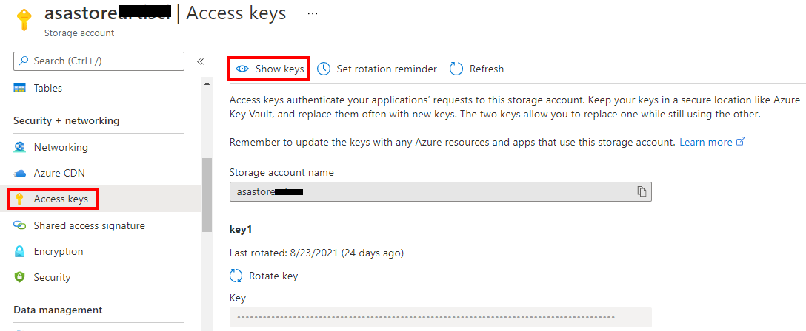
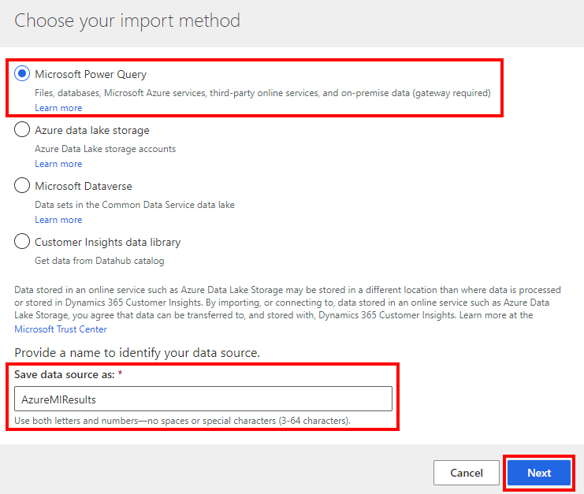
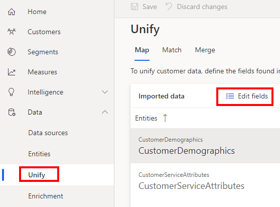
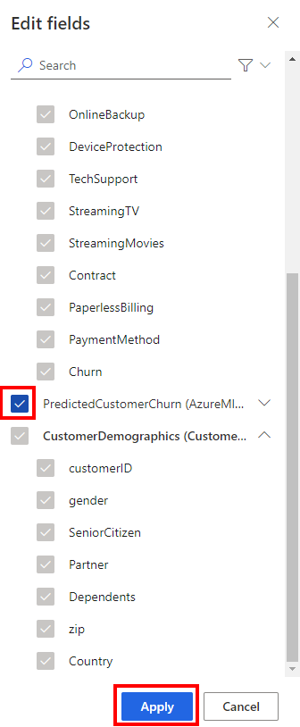
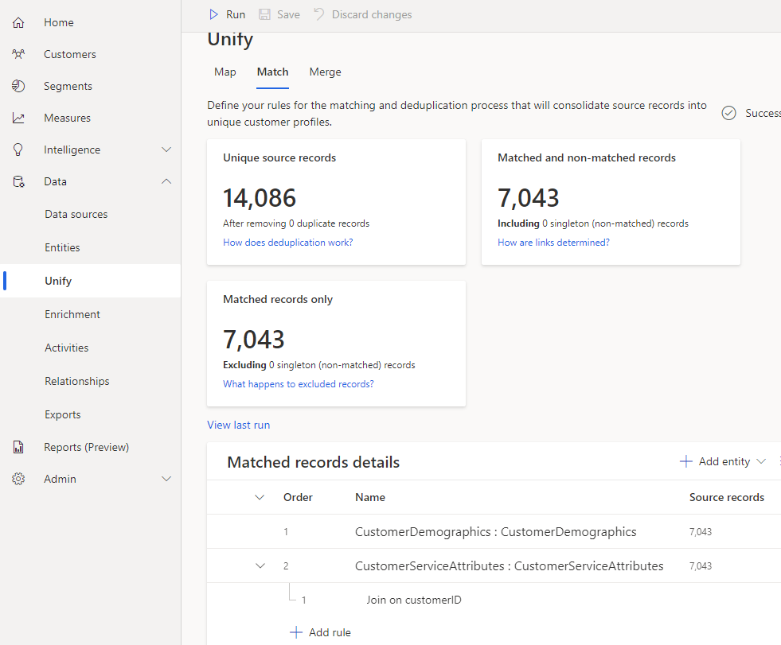
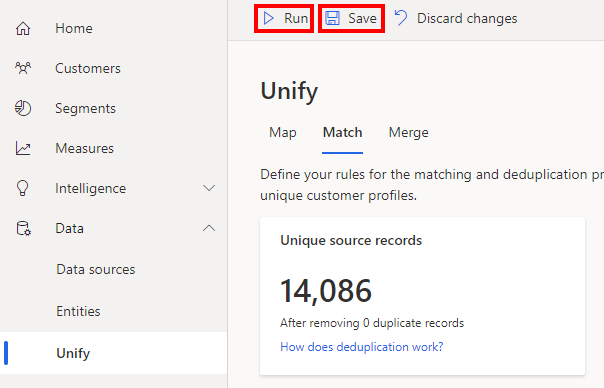
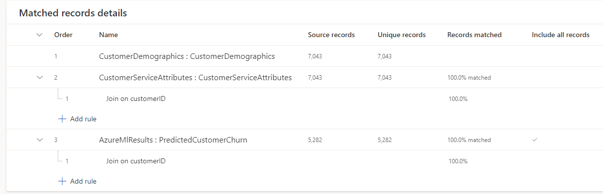
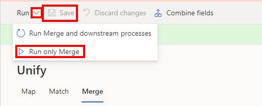

# Lab 5 - Import Machine Learning Predictions into Customer Insights

 

#  

Contents

# 

[Lab Overview](#lab-overview)

[Introduction](#introduction)

[Objectives](#objectives)

[Exercise 1: Import Machine Learning Output to Customer
Insights](#exercise-1-import-machine-learning-output-to-customer-insights)

- [Step 1: Copy the storage account key for your Azure ML storage account](#step-1-copy-the-storage-account-key-for-your-azure-ml-storage-account)

- [Step 2: Import Machine Learning Output to Customer Insights](#step-2-import-machine-learning-output-to-customer-insights)

- [Step 3: Segment your customers at highest risk of churning](#step-3-segment-your-customers-at-highest-risk-of-churning)

[Summary](#summary)

# 

# Lab Overview

## Introduction

This final lab will close the loop by importing back to Customer
Insights the results of your machine learning model which predicts which
customers are likely to churn.

## Objectives

The objectives of this exercise are to:

-   Learn how to import the results from your machine learning model
    back into Customer Insights

The estimated time for this lab is 45 minutes

# Exercise 1: Import Machine Learning Output to Customer Insights

In this section you will learn how to import the results of your machine
learning models into Customer Insights.

## Step 1: Copy the storage account key for your Azure ML storage account

1.  Browse to <https://portal.azure.com> and sign in with your
    organizational account.

    Search for “asastore” in the search box at the top:

    

1.  On the Security + networking… Access keys blade, click the “Show keys”
    button:

    

1.  Click the Copy to clipboard button on the right side of the Key textbox
    under the key1 section:

    

## Step 2: Import Machine Learning Output to Customer Insights

1.  Browse to <https://home.ci.ai.dynamics.com/> and sign in with your
    organizational account.

    On the Data… Data sources left nav, click the “+ Add data source”
    button:

    

1.  Choose Microsoft Power Query and give it the name “AzureMlResults” and click Next.

    

1.  Click the Azure tab in the Power Query Online window and click the Azure
    Blobs option:

    

1.  In the “Account name or URL” type in the name of your storage account
    for Azure ML (asastore\<suffix>) replacing your suffix. Change the
    Authentication kind to Account key. Paste in the storage account key for
    your asastore\<suffix> storage account. Click Next.

    

1.  Click the checkbox on the container called “azureml-blobstore-\<guid>”
    and click the Transform data button.

    

1.  On the Name column click the dropdown and choose Text filters… Equals:

    

1.  Paste “azureml/Decision_Tree_Results/dtresults/data.csv” into the Filter
    rows dialog and click Ok.

    

1.  Power Query Online should now show one row with the CSV file which is
    the output of your ML model. Click the \[Binary\] link in the Content
    column for that one row:

    

1.  The columns in your ML results file should show on the screen. On the
    Transform tab, click the “Use first row as headers” button:

    

1.  The first row has now been promoted to column headers. Now click the ABC
    button on the Scored Probabilities column and choose “Decimal number” to
    convert that column to a decimal.

    

1.  Rename this query to PredictedCustomerChurn.

    

1.  On the “Add column” tab click the “Conditional column” button:

    

1.  Name the new column ChurnRisk and setup the conditions as follows. If
    the model predicts the customer will not churn (Scored Labels=No),
    return Low. If the model predicts they have a 50% or greater probability
    of churning (because if it got to this condition, Scored Labels must
    equal Yes, and Scored Probabilities \> .5) return High. Otherwise return
    Medium. Then click OK and click Next.

    

1.  Accept manually should be selected. Click Save:

    

1.  Click the radio button to the left of the AzureMlResults data source and
    click the Refresh button at the top of the screen.

    

1.  On the Data… Unify left nav, click the Edit fields button.

    

1.  Click the checkmark next to the PredictedCustomerChurn entity and click
    Apply:

    

1.  Click the PredictedCustomerChurn entity and set the primary key to
    customerID and click Save.

    

1.  Go to the Match tab and click the “+Add entity” button and choose the
    PredictedCustomerChurn entity:

    

1.  Click the “+Add rule” button under the AzureMlResults :
    PredictedCustomerChurn entity:

    

1.  Choose the CustomerDemographics entity and the customerID fields on both
    entities. Name this rule and click Done:

    

1.  Click Save and then Run at the top of the screen:

    

1.  Once the run is successful, your results should look like:

    

1.  On the Merge tab, click the “Excluded fields” link:

    

1.  Click the arrow next to Scored Labels, Scored Probabilities, and
    ChurnRisk fields to include those fields in the merging. Click the Done
    button.

    

1.  Scroll down to the bottom of the field list, mouse over the Scored
    Labels field and click the Rename button. Rename Scored Labels to
    “PredictedChurn”. Rename Scored Probabilities to
    “PredictedChurnProbability”.

    

    

1.  Click **Save** and **Run… Run Only Merge** at the top of the screen.

    

1.  Once the run is successful, go to the Data… Entities left nav, click on
    the Customer entity, go to the Data tab and scroll to the right. You
    should see that the PredictedChurn and PredictedChurnProbability are now
    included as fields in the customer entity. For clarity, customer
    0423-UDIJQ has not yet churned (Churn=No) but has a 52% probability of
    churning (PredictedChurn=Yes, PredictedChurnProbability=0.52) at some
    point soon per the ML model. Customer 2480-JZOSN has not yet churned
    (Churn=No) and the model predicts with a probability of 36% that they
    will not churn (PredictedChurn=No, PredictedChurnProbability=0.36). In
    other words, a high (close to 1.0) PredictedChurnProbability doesn’t
    alone mean they are predicted to churn. The probability is the
    probability associated to the PredictedChurn field. The customers with a
    blank PredictedChurn were part of the training set in Azure Machine
    Learning so no prediction was made.

    

## Step 3: Segment your customers at highest risk of churning

1.  Go to the Customers left nav and click “Search & filter index”. Let’s
    find any customers which have a high probability of churning.

    

1.  Click the “+Add” button to add a field to the index:

    

1.  Check the Churn, PredictedChurn and ChurnRisk fields (decimal fields are
    not currently supported) and click Add.

    

1.  Mouse over the **ChurnRisk** field and click the **funnel icon** to
    enable filtering on this field. Do the same for the **Churn** field.

    

1.  When prompted after clicking the funnel icon, accept the default options
    and click **OK**.

    

1.  Then click the **Save** and **Run** buttons. When refreshing completes,
    click the **Back to Customers** button.

    In the right side Filter customers pane, filter to Churn=No (not
    currently churned) and ChurnRisk=High (high predicted risk of churning
    soon). Now you have filtered your 7,000 customers down to a list of 478
    customers at highest risk of churn. Let’s take action on this list of
    customers.

    

1.  Click the **Save filters as segment** link and enter a name for this new
    segment of customers. Click **Save**.

    

1.  Click **Activate**.

    

1.  Go to the Segments left nav, select the Customers at High Risk of Churn
    segment, wait for it to finish refreshing, then click the **Download**
    button. You can send this file to your customer care department and ask
    them to come up with strategies to boost customer satisfaction and
    improve retention for these high risk customers.

    

# Summary

In this lab, you imported the results of your machine learning model
back into Customer Insights and merged this information into the
Customer entity. Now you are able to take action from Customer Insights
on customers who are predicted to churn.

Next, go to [Lab 6](lab06.md).