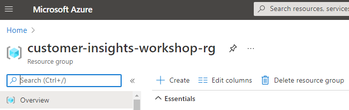

# Lab 6 – Automating with Synapse Pipelines

 

#  

Contents

# 

[Lab Overview](#lab-overview)

[Introduction](#introduction)

[Objectives](#objectives)

[Exercise 1: Orchestrate the refresh and transformation of the customer
charges
file](#exercise-1-orchestrate-the-refresh-and-transformation-of-the-customer-charges-file)

- [Step 1: Open Synapse Studio in a web browser](#step-1-open-synapse-studio-in-a-web-browser)

- [Step 2: Download the sample charge detail file](#step-2-download-the-sample-charge-detail-file)

- [Step 3: Automate the data integration and transformation for customer charges](#step-3-automate-the-data-integration-and-transformation-for-customer-charges)

[Exercise 2: Automate the rerun of your machine learning
pipeline](#exercise-2-automate-the-rerun-of-your-machine-learning-pipeline)

- [Step 1: Setup a Synapse pipeline which runs your machine learning pipeline](#step-1-setup-a-synapse-pipeline-which-runs-your-machine-learning-pipeline)

- [Step 2: Schedule the Synapse pipeline](#step-2-schedule-the-synapse-pipeline)

- [Step 3: Schedule the data source refresh in Customer Insights](#step-3-schedule-the-data-source-refresh-in-customer-insights)

[Exercise 3: Cleanup Azure resources (optional)](#exercise-3-cleanup-azure-resources-optional)

[Summary](#summary)

# 

# Lab Overview

## Introduction

This hands on lab will automate the refresh and transformation of a key
customer charges file with Synapse pipelines and Mapping data flows. It
will then automate the execution of the Azure ML pipeline using Synapse
pipelines and how to automate the refresh of data into Customer
Insights.

## Objectives

The objectives of this exercise are to:

-   Learn how to utilize Synapse pipelines and Mapping data flows to do
    data integration and transformations with a drag-and-drop interface

-   Learn how Synapse pipelines can schedule a machine learning to rerun

-   Learn how to schedule the refresh of data into Customer Insights

The estimated time for this lab is 45 minutes

# Exercise 1: Orchestrate the refresh and transformation of the customer charges file

In this section you will perform some data integration and data
transformation tasks to refresh the customer charges summary file from a
more detailed file. You will use Synapse pipelines and Mapping data
flows to accomplish this.

## Step 1: Open Synapse Studio in a web browser

Go to <https://portal.azure.com> and sign in with your organizational
account.

In the search box at the top of the portal, search for “asaworkspace”
and click on the Synapse workspace (not the SQL Server) which appears
under the Resources section.

On the Overview blade and the Essentials section, click the Workspace
web URL link to open Synapse Studio.

## Step 2: Download the sample charge detail file

1.  Right click on this
    [CustomerChargesDetail.csv](https://raw.githubusercontent.com/ArtisConsulting/customer-insights-azure-data-workshop/main/SampleData/CustomerChargesDetail.csv)
    link and choose “Save link as…” and name the file
    **CustomerChargesDetail.csv** (not CustomerChargesDetail.txt) on your workstation. We will now upload this
    file to Azure Data Lake Storage Gen2 (ADLS).

1.  Click on the Data pane on the left. It is the
    
    icon. Then go to the Linked tab. Expand Azure Data Lake Storage Gen2 and
    click on the default storage account (asaworkspace\<suffix>) and click
    on the staging container.

    

1.  Click the “+ New folder” button and create a new folder called
    **ChargesDetail**.

    

1.  Double click the new ChargesDetail folder. Then click the Upload button:

    

1.  Choose the CustomerChargesDetail.csv file you previously downloaded and
    click Upload.

    

    For sake of this hands-on-lab, we will pretend that this
    CustomerChargesDetail.csv file is being updated and uploaded to this
    location daily by your accounting system.

## Step 3: Automate the data integration and transformation for customer charges

Let’s create a Synapse pipeline which takes the
CustomerChargesDetail.csv file and transforms it using a Mapping data
flow into the CustomerCharges.csv file we use in other labs. Mapping
data flows are a visually-designed data transformations. A mapping data
flow is executed under the covers on highly scalable Spark compute.

1.  Go to the Integrate tab (the pipeline icon) in Synapse Studio:

    

1.  Click the + sign and choose Pipeline to create a new Synapse pipeline.

    

1.  In the Properties pane on the right, rename the pipeline and provide a
    description:

    

1.  In the Activities pane search for “data flow” and drag the
    **Data flow** module onto the canvas.

    

1.  With the Data flow module selected, view the General tab at the bottom
    of the screen and rename the module:

    

1.  On the Settings tab, click the +New button to create a new Mapping data
    flow:

    

1.  In the properties pane rename to “dfRefreshCustomerCharges” (“df” stands
    for data flow):

    

1.  Click the “Add source” box:

    

1.  In the “Source settings” tab at the bottom name it
    **CustomerChargesDetail**, change to an **inline** source type, choose a
    **DelimitedText** dataset type, and choose the
    “**asaworkspace\<suffix>-WorkspaceDefaultStorage**” linked service
    (which was created automatically when the Synapse workspace was
    created).

    

1.  On the “Source options” tab click the Browse button on the File path:

    

1.  Browse to staging/ChargesDetail and select CustomerChargesDetail.csv and
    click OK:

    

1.  Check the “first row as header” checkbox:

    

1.  On the Projection tab, notice the “Import schema” button is grayed out.
    Click the “Data flow debug” toggle at the top of the mapping data flow
    in order to spin up debug compute to assist in developing and debugging
    this mapping data flow.

    

1.  Accept the defaults and click OK. The debug time to live of 1 hour means
    that the compute will auto-pause after 1 hour of inactivity in order to
    reduce your Azure cost.

    

1.  Wait about 2-5 minutes until the data flow debug compute spins up. When
    complete you will get a notification in the top right and there will be
    a green checkmark next to the Data flow debug toggle. If you step away
    for more than an hour, the toggle debug compute will auto-pause and you
    will have to click the toggle again manually.

    

    

1.  Click the Import schema button (which was grayed out in step 13) now. Accepting the default formats is
    adequate for our file. Click the Import button at the bottom to accept the defaults:

    

1.  Wait a few seconds for the schema to be loaded. Now the schema for this CustomerChargesDetail source is populated.

    

1.  Go to the **Data preview** tab and click the **Refresh** button to see a
    preview of a few rows of this dataset.

    

1.  This file has one row per service per customer per month. We want to
    perform two data transformation tasks. First, we want to sum together
    the Charge and Tax columns. Second, we want to summarize all the
    services together into a single total charge per customer per
    ChargeDate.

    Click the + sign next to the CustomerChargesDetail source and choose
    Derived Column

    

1.  Describe what you are doing in the Output stream name, set the column
    name to TotalCharges, and set the expression to Charge + Tax (you can
    click the “Open expression builder” button for help with building more
    complex expressions.

    

1.  Click the + sign next to the SumChargesAndTax transform and add
    Aggregate:

    

1.  Name the output stream AggregateByCustomerMonth (there is only one
    ChargeDate per month in the file), add customerID and ChargeDate
    (clicking the + sign next to customerID to add the second column to the
    Group by section:

    

1.  Then click the “Aggregates” selector and add a TotalCharges column with
    expression sum(TotalCharges) which will aggregate the TotalCharges
    derived column to the per customer/ChargeDate grain.

    

1.  Click the + sign next to the AggregateByCustomerMonth and choose
    **Select**:

    

1.  The column order looks like this to begin with:

    

1.  Rename the TotalCharges column to just Charge and mouse over that row
    until you see the six dots to the left of the row and drag it to reorder
    the columns. The columns should be in the order customerID, Charge,
    ChargeDate since this is the file format expected downstream.

    

1.  Go to the Data preview tab on the Select1 module and click Refresh.
    Validate that the columns are in the order matching this screenshot and
    the column names match exactly:

    

1.  Now let’s write out the results. Click the + icon next to the Select1
    module and search for “sink” and choose Sink:

    

1.  Name the output stream CustomerCharges, choose an Inline sink type,
    choose a DelimitedText dataset type, choose the
    “asaworkspace\<suffix>-WorkspaceDefaultStorage” linked service:

    

1.  Choose the staging container and the Charges folder. Check the “first
    row as header” checkbox and the “Clear the folder” checkbox:

    

1.  On the Optimize tab of the CustomerCharges sink you can keep the current
    “use current partitioning” setting as this will output multiple files in
    a highly parallel manner and generally perform better. The downstream
    Synapse Serverless SQL view called dbo.CustomerChurnCharges has been
    coded to read all files in the folder rather than looking for a specific
    filename. (If your scenario requires a single filename then choose “Single
    partition” but realize that will hurt performance.)

    

1.  Flip back to the RefreshCustomerCharges pipeline tab, click the Debug
    dropdown and choose “Use data flow debug session”:

    

1.  Go to the Data left nav, the Linked tab, choose the primary storage
    account, choose the staging container, browse to the Charges folder and
    you should see about 200 CSV files which are about 38KB each (compared
    to the original 7MB CustomerCharges.csv file):

    

1.  Click the Publish all button to save the pipeline and mapping data flow
    and make them available to schedule or for other users to see.

    

1.  Confirm the list of objects to publish and click the Publish button at
    the bottom:

    

# Exercise 2: Automate the rerun of your machine learning pipeline

In this section you will automate the execution of your machine learning
pipeline. There are several ways to automate and operationalize your
model. One option is to publish a batch inference pipeline which reuses
a trained model to make more predictions (inferences). A second option is
to automate the execution of the entire pipeline which retrains models
and scores the dataset with each execution. We will use this
second option in this lab.

## Step 1: Setup a Synapse pipeline which runs your machine learning pipeline

1.  On the Integrate left nav, open the RefreshCustomerChargesAndChurnML
    pipeline, search for “machine” in the Activities panel, and drag
    **Machine Learning Execute Pipeline** onto the canvas:

    

1.  Drag the green square from the Refresh Customer Charges data flow module
    to the Machine learning module. This sets a dependency to ensure the
    refresh of the charges file completes successfully before the machine
    learning pipeline is run:

    

1.  Click on the ML module and rename it Execute Churn ML Pipeline:

    

1.  On the Settings tab for the ML module, click the new button to create a
    new Azure ML linked service:

    

1.  Name the linked service “lsAzureML” (the “ls” prefix stands for Linked
    Service), ensure the authentication is the (Synapse) Managed Identity
    (which was granted RBAC Contributor role on the Azure ML workspace in
    the ARM template), then choose the right Azure subscription and the
    “amlworkspace\<suffix>” Azure ML workspace.

    

1.  Click “Test connection” and you should see a “Connection successful”
    message. Click Create.

    

1.  Change the Pipeline ID type to “Pipeline endpoint ID”, choose the
    CustomerChurnEP endpoint, choose the pipeline version you want (possibly
    version 0), and set the Experiment name to SynapseAutomatedChurn:

    

1.  Click the Debug button at the top of the
    RefreshCustomerChargesAndChurnML pipeline. After 15 minutes or so the
    debug run should complete successfully. (Tip: If you don’t see the
    Output tab, click on the canvas background rather than on a module in
    the pipeline.) Mouse over the Execute Churn ML activity row and click
    the eyeglasses icon to see more details about that execution. Click the
    link to see details from the Azure ML pipeline execution.

    

1.  Click Publish all:

    

1.  Confirm the two objects which are changed:

    

## Step 2: Schedule the Synapse pipeline

1.  Click the Add trigger button at the top of the
    RefreshCustomerChargesAndChurnML Synapse pipeline and choose New/Edit:

    

1.  On the Add triggers pane, choose +New from the dropdown:

    

1.  Name the trigger Daily3am. Set the Start date to 3:00AM tomorrow. Choose
    your time zone. Change the recurrence to every 1 day. Then click OK two
    times.

    

1.  Click Publish all and confirm the trigger to be published. Click
    Publish.

    

1.  If you ever want to adjust the trigger, go to the Manage left nav,
    Triggers left nav. Mouse over the Daily3am trigger and click the start
    or stop icon to toggle whether this trigger is active. (If there was an
    error activating the trigger during publishing, you can retry
    starting/activating the trigger on this screen.)

    

## Step 3: Schedule the data source refresh in Customer Insights

1.  At <https://home.ci.ai.dynamics.com/> on the Data… Data sources left
    nav, click the … next to AzureMlResults and Edit refresh settings.

    

1.  Choose “Refresh automatically” and set it to refresh on specific days
    and times, choose Daily, and choose a time which is 30 minutes after the
    Synapse pipeline is scheduled to run. Pay attention to the time zone.
    Click Create.

    

# Exercise 3: Cleanup Azure resources (optional)

When you are **COMPLETELY DONE** with all your work, you can optionally
delete these Azure resources. Go to the Overview blade of the
**customer-insights-workshop-rg** in the Azure portal and click the
**Delete resource group** button. Your Azure resources and all the data
in them will be **deleted and unrecoverable**.

# Summary

In this lab, you learned how to automate the refresh and transformation
of a key customer charges file with Synapse pipelines and Mapping data
flows. Then you learned how to automate the execution of the Azure ML
pipeline using Synapse pipelines and how to automate the refresh of data
into Customer Insights.
