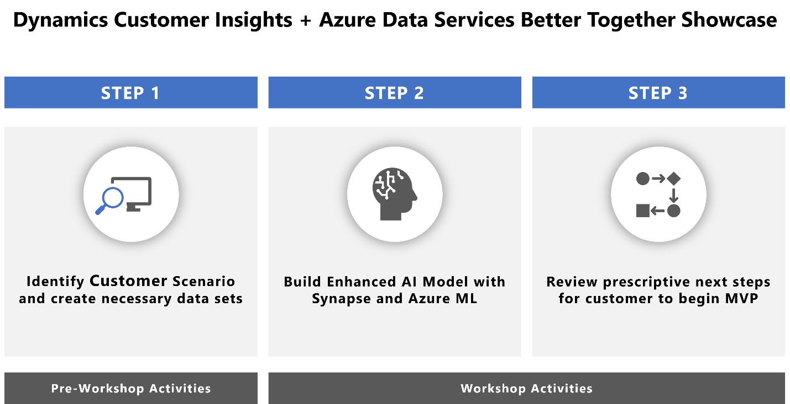
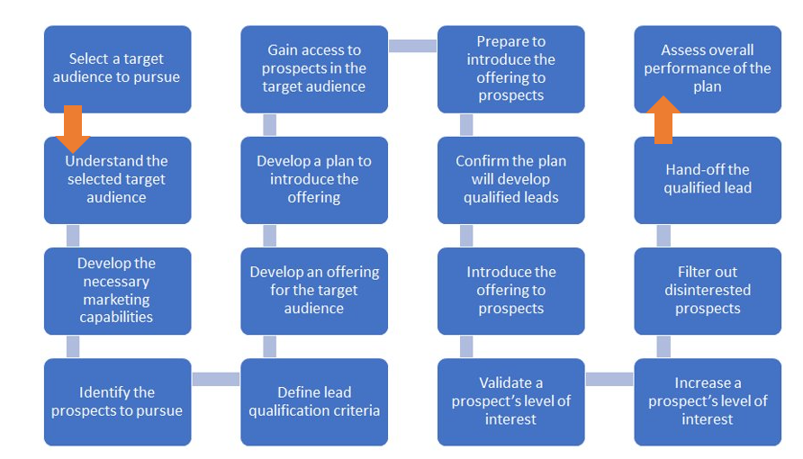
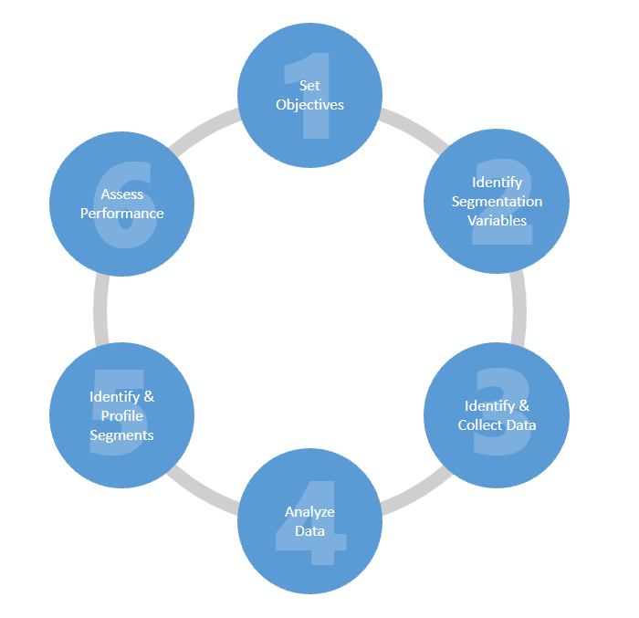
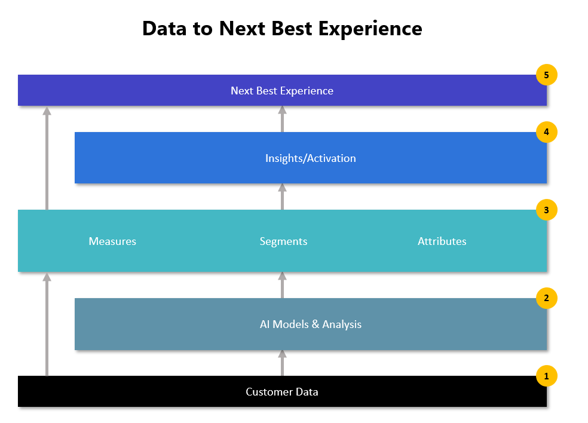
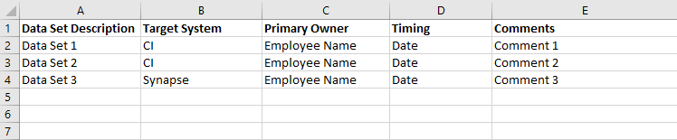

# Customer Insights + ADS Workshop Playbook

# Abstract and Learning Objectives

This playbook encompasses a customer engagement and hands-on workshop
designed for Microsoft customers who wish to accelerate their digital
transformation journey by getting closer to their customers with
Dynamics Customer Insights (CI) and enhance their Modern Data Platform
by integrating Dynamics Customer Insights with other Azure Data & AI
Services (ADS).

The engagement consists of working sessions with the customer to define
their business objectives and identify the necessary data sets to
accomplish the objectives and culminates in a 1-day workshop to build an
end-to-end data analytics solution with a machine learning model using
Dynamics Customer Insights (CI), Azure Synapse Analytics and Azure
Machine Learning (ML) with the customer’s data in the customer’s Azure
tenant.

We will be leveraging:

-   Azure Synapse Studio, a tool that conveniently unifies the most
    common data operations from ingestion, transformation, querying and
    visualization.

-   Dynamics 365 Customer Insights, an enterprise customer data platform
    that brings together transactional, behavioral, and demographic data
    in real time to create a 360-degree view of customers and delivers
    customer experiences with AI and analytics.

-   Azure ML, a service the empowers data scientists and developers with
    a wide range of productive experiences to build, train, and deploy
    machine learning models and foster team collaboration.

# Overview (Executive Summary)

The customer engagement and workshop offer a repeatable approach to
working through the scenario of using AI/ML to drive marketing execution
and developing a plan for an MVP solution implementation. The 1-day
workshop combines steps two and three of a three-step approach (pictured
below) to engage the Marketing, Data and Data Science groups of an
organization to drive the usage of Azure AI/ML services with Dynamics
Customer Insights as a better together showcase.

This playbook provides guidance for engaging with the Marketing, Data
and Data Science groups of the client before and during the workshop to:

1.  Identify the business objectives for the engagement (including the
    specific AI model to build)

2.  Define the scope and success measures for the engagement

3.  Identify and prepare all the necessary data sets for the 1-day
    CI+ADS workshop

4.  Build the AI model in Customer Insights

5.  Perform the 1-day CI+ADS workshop

6.  Plan a set of prescriptive next steps with the customer to deliver
    an MVP solution engagement to operationalize the model.

## Solution Architecture

The solution architecture for this engagement is pictured above and
enables the following scenario:

-   Export data from Dynamics 365 Customer Insights to Azure Synapse
    Analytics through Azure Data Lake Store.

-   Orchestrated by Azure Synapse Analytics Pipelines, Azure Synapse
    Analytics Serverless SQL Pools and Mapping Data Flows transform and
    enrich the datasets.

-   Azure Machine Learning trains predictive models and predicts key
    attributes around your customers.

-   These predictions land in Azure Blob Storage and are loaded back
    into Dynamics 365 Customer Insights to enrich your customer
    entities.

# Step 1: Pre-Workshop Activities

Before conducting the 1-day workshop, spend time (3-4 days) working with
the customer to accomplish the following:

-   Define business objectives

-   Define the scope of the project

-   Define the measurements of success for the project

-   Create the data set(s) to utilize in the workshop

## Define Business Objectives

Customer Insights enables customers to plan, market, and sell
strategically with machine-learning models that use customer’s data to
predict customer behavior. To begin this engagement, facilitate client
conversations to help the client understand how AI/ML can improve their
marketing execution and drive revenue via three Customer Insights AI
models:

-   **Customer Churn Model** – Identify which customers might churn so
    you can adapt your product or messaging to retain them.

<!-- -->

-   **Product Recommendations** – Use data from customer purchases and
    preferences to suggest products they’re most likely to want.

-   **Customer Lifetime Value** – Predicts how much money customers are
    likely to spend with your business during a specific timeframe.

### Working Session 1

To define the business objectives, we recommend facilitating a 2-hour
working session with the client stake holders to identify which of the
three models can provide the most benefit to their organization.

Structure the session as follows:

-   Introduce how AI/ML improves marketing capabilities

-   Walk through what Customer Insights is and the three AI models
    customers can build

-   Walk through how Customer Insights and Azure Data Services can be
    paired to create more value

-   Engage the customer in conversation to determine which model they
    want to work with and why

-   Engage the customer in conversation to define success measures for
    the engagement

#### Introduce how AI/ML improves marketing capabilities

AI can help marketing better target customer segments to drive revenue
growth by improving the customer experience (providing the right offer
to the right customer at the right time). AI can deliver the greatest
value when you can clearly define an objective that you trying to
optimize, and you can design a mechanism to collect data at scale that
gives you valuable information around that objective.

Customer Insights and ADS provide the mechanism to collect data at
scale, while AI models enable you to improve the customer experience in
less time with more accuracy.

The act of developing qualified leads to drive marketing campaigns
involves many steps, as the diagram below shows:

Figure - From [Mike
Boysen](https://jobstobedone.substack.com/p/describing-the-objectives-within)

Walk the customer through these steps and ask:

-   When it comes to creating qualified leads, what are your goals and
    objectives?

-   When it comes to creating qualified leads, what problems are you
    trying to prevent or resolve?

-   What products/services do you currently use to accomplish these
    steps?

-   Do you find it frustrating to have to cobble together multiple
    methods and tools to accomplish these steps?

-   Do any of these steps take too much time?

-   Do you get inconsistent results?

Record the answers to these questions as you work through the steps and
ask follow-up questions to get quantifiable/qualitative areas for
improvement. In addition, ask what data they use during each step of the
process. The answers will help you:

-   Identify specific scenarios you will focus on for this engagement

-   Document success criteria for this engagement

-   Identify data sources for the engagement

-   Identify features to focus on with Customer Insights and ADS

Here’s a recommended approach for documenting the business objectives
and success criteria. List the individual objectives in the left-hand
column, provide a description of the objective and the impact to the
business if they accomplish the objective. Look for qualitative or
quantitative impacts and add those to the impact description.

Marketing professionals follow the process pictured below to create
customer segments and execute campaigns to drive revenue:

Introduce this graphic and begin a new conversation on how Customer
Insights and AI can improve their ability to identify and create better
segments to drive the customer experience and increase revenue.

#### Walk through what Customer Insights is and the three AI models customers can build

**Microsoft to provide overview content.**

#### Walk through how Customer Insights and Azure Data Services can be paired to create more value

**Microsoft to provide overview content.**

#### Engage the customer in conversation to determine which model they want to work with and why

After the overview of Customer Insights and Azure Data Services,
facilitate a conversation with the customer to identify the specific
model they want to build for this engagement.

Begin the conversation by sharing a slide with the definitions of each
of the 3 models:

-   **Customer Churn Model** – Identify which customers might churn so
    you can adapt your product or messaging to retain them.

<!-- -->

-   **Product Recommendations** – Use data from customer purchases and
    preferences to suggest products they’re most likely to want.

-   **Customer Lifetime Value** – Predicts how much money customers are
    likely to spend with your business during a specific timeframe.

Facilitate the conversation with open-ended questions. Spend time
discussing the models and how they can have a positive impact on their
business. Call back to the prior conversation points related to creating
qualified leads as appropriate. For instance, begin by asking one of
these questions:

-   “Which of these three models do you feel can make the biggest impact
    to your business, and why?”

-   “If you had the ability to accurately predict customer churn (or
    make accurate product recommendations or accurately predict customer
    lifetime value), in what ways would that impact your business?”

Record the answers on a shared display so everyone can view the answers.
Identify specific answers where better data and the use of AI can
improve marketing capabilities so the customer can see how they will
improve their marketing capabilities.

After gathering everyone’s feedback work towards identifying which model
the customer would like to utilize for the engagement. Ask attendees to
vote for the model they want to utilize for this engagement. Enable each
attendee to select the model they vote for and record the votes on the
shared display. If there is a tie, have a final decision maker decide.
Reiterate they will be able to do all these models with Customer
Insights and ADS at any time, but for this engagement we will narrow the
scope to one.

#### Engage the customer in conversation to define success measures for the engagement 

With the data you have collected in the prior conversations, work with
the group to define what success will look like for this engagement.
Ensure measures of success for the engagement also include process
improvements. Here are a few success measures to consider:

-   How long it takes to create a model in Customer Insights versus
    today (if they are creating AI models for marketing).

-   How long it takes to turn the model results into a marketing
    campaign and run the campaign

-   Create more fine-grained segments than what was possible before

At the end of this working session, you should have set the objectives
of the engagement by defining the model you will build for this
engagement, identified specific steps in the marketing process you will
be improving and documented high-level success measures to prove out.

#### Schedule the Next Working Session

Before ending the session, schedule the next working session to begin
the process of identifying the data sets needed for this engagement. The
next session should consist of:

-   Defining the customer data that will be needed to create the model

-   Defining the scope of the project from a data inventory prospective
    (how much data you will be utilizing for the engagement)

-   Identifying the data sources to use for the engagement

-   Scheduling working sessions to get the data in a ready state

-   Scheduling a session to set up their Azure tenant

Get confirmation on the necessary data owners (from the IT and Data
Science side of the organization) to invite to the next session to
ensure you have the proper stakeholders in that meeting.

## Working Session 2 - Identify necessary data sets for the 1-day CI+ADS workshop

Determining the proper amount of data to use to build the AI model is a
critical component for this engagement. A key concept to communicate to
the customer is AI can deliver the greatest value when you can clearly
define an objective that you are trying to optimize, **and** you can
design a mechanism to collect data at scale that gives you valuable
information around that objective.​

During the second working session create a plan to accumulate all the
data you will need for the 1-day workshop. Start the working session by
walking the customer through the 5-step process you will utilize for
this engagement. This process will enable the client to go from a raw
set of customer data to a highly targeted marketing campaign to drive
improved customer experience and revenue growth. This same process can
be used for any of the AI models available within Customer Insights.

Process to employ with the customer to build the AI model:

-   Step 1 – Bring customer data into Customer Insights

-   Step 2 – Walk through the specific AI model dialog in Customer
    Insights

-   Step 3 – Create the necessary segments, measures, and attributes to
    target specific customers

-   Step 4 – Predict recommendations for the segment.

-   Step 5 – Create the next best customer experience by running a
    targeted campaign with the offer

### Data Set Guidance 

Microsoft docs provides specific data requirements to utilize the
predefined models in Customer Insights. At the time of this playbook,
the following models are available. Click on each link to find the data
requirements for each model. You will need to work with the customer to
identify the data sets you want to use and ensure they meet the data
requirements needed by Customer Insights.

-   [Customer lifetime
    value](https://docs.microsoft.com/en-us/dynamics365/customer-insights/audience-insights/predict-customer-lifetime-value):
    Predicts the potential revenue of a customer throughout the entire
    interaction with a business.

-   [Product
    recommendation](https://docs.microsoft.com/en-us/dynamics365/customer-insights/audience-insights/predict-product-recommendation):
    Suggests sets of predictive product recommendations based on
    purchase behavior and customers with similar purchase patterns.

-   [Subscription
    churn](https://docs.microsoft.com/en-us/dynamics365/customer-insights/audience-insights/predict-subscription-churn):
    Predicts whether a customer is at risk for no longer using your
    company’s subscription products or services.

-   [Transactional
    churn](https://docs.microsoft.com/en-us/dynamics365/customer-insights/audience-insights/predict-transactional-churn):
    Predict if a customer will no longer purchase your products or
    services in a certain time frame.

### Create the Data Inventory

Create an inventory of data sets to identify the scope and set deadlines
to get the data into a ready state for the workshop. Within the
inventory log identify the data set, the target system the data will
flow into, who to work with to get the data in a ready state for the
workshop (meet the requirements defined in the links above), date to
complete the work, and any additional information for the task. Your log
should contain the following items:

-   Data Set Description – Quick name/description of the data.

-   Target System – The target system the data will be brought into
    (Customer Insights or Azure Synapse).

-   Primary Owner – Customer employee that will work with the Microsoft
    team to get the data into a ready state.

-   Timing – Due date to get the data into a ready state.

-   Comments – Additional information relevant to the task.

Figure - Data Inventory Template

Complete the session by scheduling working sessions for each of the data
sets in the inventory log.

### Data Quality Assessment

The following checklist can help ensure the datasets the customer have
chosen will be adequate for the workshop:

-   The customer datasets loaded to Dynamics 365 Customer Insights have
    a common customer identifier to join the datasets. Some overlapping
    sets of customers appear in each of the datasets (rather than each
    dataset being a distinct list of customers).

-   The transaction data which will enrich your customer data in Azure
    Synapse Analytics should be able to join on one of the customer IDs
    you have in Dynamics 365 Customer Insights

-   The business users have chosen a business outcome or customer
    attribute to predict. We call this the “dependent variable”. (In the
    example datasets for the lab, we predicted customer churn; churn was
    the dependent variable.) The business users should theorize that the
    customer attributes, demographic attributes, and transaction data
    may help a machine learning model better predict this dependent
    variable. The dependent variable should already be known for some
    subset of customers. (In the example datasets for the lab, we know
    the churn status of each customer and used 25% of the rows to train
    the model. However, for the selected business scenario, you may know
    the dependent variable on 20% of your customers and train a model to
    predict that information about the other 80% of customers.)

To learn how to automate and orchestrate data integration with Mapping
Data Flows, [Lab 6](lab06.md)
takes some detailed transaction data, summarizes, and calculates derived
columns (summing several columns together).

## Prepare for the 1-Day Workshop

There are six labs for the [Customer Insights and Azure Data Services
Workshop](README.md).
Two of the labs need to be completed with the customer **before** the
1-day workshop is scheduled.

-   [Lab 1](lab01.md)
    – Customer Insights Data Sources, Unification and Enrichment

-   [Lab 2](lab02.md)
    – Deploying Azure Services

Once all the necessary data sets are in a ready state, schedule a
working session with the customer and work through Lab 1 of the
workshop.

In parallel, schedule a working session with the customer and work
through Lab 2 of the workshop to deploy all necessary Azure Services in
the customers’ tenant.

After the completion of Lab 2 identify all necessary stakeholders for
the workshop and schedule the 1-day workshop.

# Customer Insights + ADS Workshop

## Workshop Overview

The [Customer Insights + ADS workshop](README.md)
will help the customer get hands-on experience integrating Dynamics 365
Customer Insights and Azure Data Services. At the end of the workshop,
attendees will spend 45 minutes building a high-level plan for an MVP
engagement to operationalize the AI models.

## Workshop Agenda

| Time          | Activity                                                                                                                                                                                                                                             |
|---------------|------------------------------------------------------------------------------------------------------------------------------------------------------------------------------------------------------------------------------------------------------|
| 9:00&nbsp;–&nbsp;10:00  | Review engagement details (Objectives, Success Measures, Scope), all the work done to date (including the 2 labs that have been completed), and the purpose of the workshop today (**walk through Azure Data Services decks – Microsoft provided**). |
| 10:00&nbsp;–&nbsp;11:00 | [Lab 3](lab03.md) – Customer Insights Integration with Azure Synapse Analytics                                                                                    |
| 11:00&nbsp;–&nbsp;11:15 | Break                                                                                                                                                                                                                                                |
| 11:15&nbsp;–&nbsp;12:30 | [Lab 4](lab04.md) – Predicting Customer Churn in Azure Machine Learning                                                                                           |
| 12:30&nbsp;–&nbsp;1:30  | Lunch                                                                                                                                                                                                                                                |
| 1:30&nbsp;–&nbsp;2:15   | [Lab 5](lab05.md) – Import Machine Learning Predictions into Customer Insights                                                                                    |
| 2:15&nbsp;–&nbsp;3:00   | [Lab 6](lab06.md) – Automating with Synapse Pipelines                                                                                                             |
| 3:00&nbsp;–&nbsp;3:15   | Break                                                                                                                                                                                                                                                |
| 3:15&nbsp;–&nbsp;4:00   | Discuss and build high-level plan for MVP engagement                                                                                                                                                                                                 |

